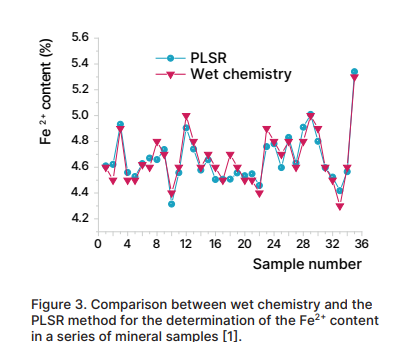
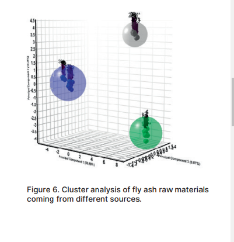
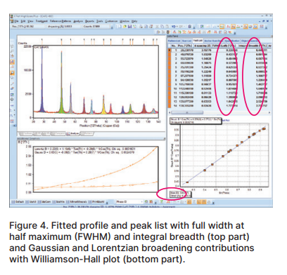
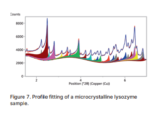

### 재료 내의 결정 성분 결정:
상 분별
+ 검색-일치
피크 및 프로필 데이터를 결합하고 기존 후보 목록의 점수를 즉시 재평가하는 강력한 검색-일치 알고리즘입니다.
+ 자동 식별(자동으로 비슷한 데이터를 검색해서 식별화하는것)
후보의 최적 일치 항목은 세련된 필터를 사용하여 자동으로 수락될 수 있습니다.
+ 화학 계산기
화학 계산기는 상의 화학 구성을 단순한 원소, 산화물, 황화물 또는 다른 화합물로 분해합니다. 단일 상이나 알려진 상 농도를 가진 상 혼합물에 사용할 수 있습니다.
+ 참조 데이터베이스
사용자가 작성한 것을 포함한 모든 참조 데이터베이스가 지원됩니다.
### 숨겨진 정보나 상관 관계 발견:
부분 최소 제곱 회귀 방법(피처추출 + 지도 차원축소방법)
HighScore의 부분 최소 제곱 회귀 (PLSR) 방법:
    • 사용자 친화적
    • 데이터를 실제 캘리브레이션과 비교하여 통계적인 접근 방식으로, 샘플 모델의 시뮬레이션과 맞춤 작업을 요구하지 않음
    • 측정 데이터를 관심 있는 샘플과 직접적으로 상관 연결

그림 3에 나타난 것처럼, PLSR 방법은 전통적인 화학 분석에 비해 상당한 시간을 절약하면서도 신뢰성이 높습니다.

### 대용량 데이터 처리:
클러스터 분석
    현대적인 X선 회절 장비는 빠른 측정을 통해 대량의 데이터를 생성합니다. 데이터 평가를 처리하기 가장 좋은 방법은 유사한 데이터 세트를 식별하고 그룹화하며, 대표적인 데이터 세트를 선택하면서 이상치를 찾는 것입니다.
HighScore에 구현된 클러스터 분석 도구는 이러한 분석을 원활하고 쉽게 수행할 수 있습니다.

### 미세 구조 조사:
응력 및 크기 분석
    결정성 물질의 미세 구조 정보는 X선 단일 피크 프로파일의 폭과 모양에서 얻어집니다. 분석 전에 HighScore는 선 넓어짐에 대한 계기적 기여를 보정할 수 있습니다.

    결과로 각 피크에 대한 미세응력 및/또는 결정립 크기 정보가 제공됩니다. 여러 피크의 경우 평균값으로 윌리엄슨-홀 플롯을 보여줄 수 있습니다 [2].

## 중첩 반사 분리:
프로파일 맞춤
피크 매개변수를 정확하게 결정하기 위해, 프로파일 맞춤은 심하게 중첩된 반사를 분리할 수 있습니다.

개선된 추출 가능한 매개변수:
• 위치
• 강도
• 넓이
• 모양

유용한 정보:
• 결정립 크기
• 미세응력

## 무질서와 지역 구조에 대한 통찰력 획득:
쌍 분포 함수
감소된 구조 함수 및 해당하는 원자 쌍 분포를 융합하고 쉽게 얻을 수 있습니다.

몇 번의 클릭으로 다음을 보정할 수 있습니다:
• 흡수
• 브렘스트라융
• 콤프톤 및 다중 산란
• 로렌츠 극성화

## 비트맵-스캔 변환기
회절 분석결과 그래프에 대한 이미지를 가공하는 비트맵 변환기
>> 그 이미지의 픽셀을 사용해서 해당 그래프의 동작을 디지털화하고 저장하는 변환기
디지털 데이터로 그래프의 동작을 저장함으로써 추후에 재사용하거나, 여러가지 방법으로 이용할 수 있다
+ 디지털 데이터로 변환했으므로 파이썬 넘파이 맷립같은 것으로 시각화 처리, 분석, 비교, 통계를 수행할 수 있다. 
+ 소프트웨어 프로그램에서 제공하는 기능 외에도 데이터를 가지고 다른 언어플랫폼이나 프로그래밍을 통해 이용할 수 있게돼고, 연구자 각자의 방법으로 디지털화 된 데이터를 깊고 다양하게 패턴 분석 및 비교를 할 수 있게된다.

