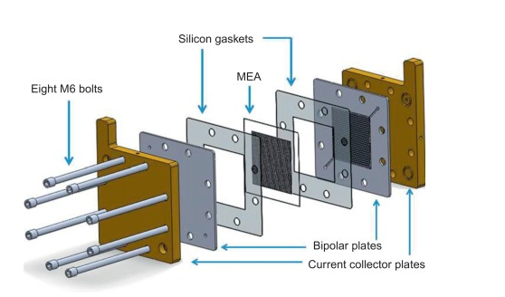
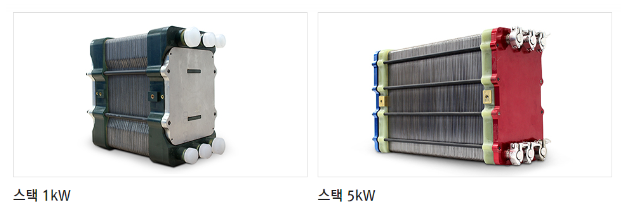

## 메조 다공성 탄소 제조 (고분자 전해질막 연료전지의 촉매 지지체로 사용하기 위해)
>>메조 다공성이란?
    나노크기의 미세한 기공이 형성된 상태를 의미{일반적으로 나노다공성과 동일한 의미로 간주}
>>고분자 전해질막이란?
    전해질막은 수소연료전지의 핵심부품중 하나이다
    선택적 투과능력을 보이는 분리막이다.
    수소가스에서 분리된 전자의 이동을 막는다
    대신 수소이온만 선택적으로 이동시킨다.
    분리막이란 이러한 전해질막의 강도를 좌우하는 뼈대이다.
    연료전지 시스템의 출력향상과 내구성에 큰 영향을 미치는 소재다.
    * 고분자 전해질 막이라고도한다
>> 수소연료전지란?
    수소와 공기 중의 산소를 이용해 화학반응을 일으켜 전기를 생산하는 장치.
    부산물로 물만 나온다.
    양 전극사이에서 수소이온을 통과시키는 전해질막이 핵심.
    이 전해질막의 수소이온 전도도는 화학반응속도에 영향을 줘서 연료전지 효율을 결정한다.
>> 전구체란?
    어떤 화학반응의 최종물질 바로 이전 단계의 물질을 의미
>> 막 전극 조립체란?
    MEA(membrane electrode assembly)라고 하며 수소연료전지에서 산소와 수소의 화학적 반응을 이끌어내 전기에너지로 변환시키는 역할을 하는 필름형태의 접합체.
    
>> 연료전지 스택이란?
    막 전극 조립체를 여러겹 적층한 구조로, 연료전지 스택 하나는 440개의 MEA로 구성된다. 스택 원가의 절반을 차지하는 핵심부품이다.
    
>> 아이오노머란?
    공유결합과 이온결합을 동시에 소유하고 있는 열가소성 플라스틱을 의미한다.
>> 분자주형법이란?
    분자설계 및 합성에 사용되는 기술.
    원하는 분자구조를 가진 화합물을 합성하기 위한 방법
    분자단위의 템플릿이나 주형을 사용.
    주로 유기화합물 합성에서 많이 사용되고, 복잡한 구조를 가지는 화합물의 합성에 유용하다.
    원하는 구조를 가진 작은 분자나 분자단위를 합성하고, 이를 기반으로 대상 화합물의 구조를 형성한다.
    템플릿 분자는 주로 미리 설계된 화합물이며, 원하는 기능이나 구조를 가진다.
    템플릿 분자를 사용해서 목표분자를 합성하는 과정에서는 템플릿 분자와 원자또는 분자단위를 연결하는 화학반응을 사용한다. 
    이를 통해 템플릿 분자의 구조가 원하는 목표분자의 구조에 전달된다.
### Introduction
A growing interest has developed for the use of polymer electrolyte membrane fuel cells (PEMFC) as an alternative power source for portable devices and electric vehicles [1]. For practical applications of PEMFC, it is necessary to design a high-performance membrane electrode assembly (MEA). It is generally accepted that the performance of an MEA is closely
related to the properties of the catalysts used in its preparation. On the other hand, the catalytic performance of a fuel cell catalyst is influenced by the physico-chemical state of the metal component (usually Pt) [2] as well as the textural properties of the carbon support [3,4]. Therefore, the design of a carbon support with a favorable structure constitutes an important first step in improving cell performance
휴대용 장치 및 전기 자동차의 대체 전원으로 고분자 전해질 막 연료 전지(PEMFC)의 사용에 대한 관심이 증가하고 있습니다[1]. PEMFC의 실용적인 적용을 위해서는 고성능 막 전극 조립체(MEA)를 설계해야 합니다. 일반적으로 MEA의 성과는 밀접하게 인정됩니다
제조에 사용된 촉매의 특성과 관련이 있습니다. 한편, 연료전지 촉매의 촉매 성능은 금속 성분(일반적으로 Pt) [2]의 물리-화학적 상태뿐만 아니라 탄소 지지체 [3,4]의 질감 특성에 의해 영향을 받습니다. 따라서, 유리한 구조의 탄소 지지체의 설계는 셀의 성능을 향상시키는 중요한 첫 단계를 구성합니다
>> 고분자 전해질 막 연료전지(PEMFC)의 실용적인 적용을 위해서 고성능 막 전극 조립체(MEA)를 설계해야한다. MEA막전극조립체는 촉매의 특성과 관련이있으며 MEA로써 탄소 지지체를 잘 설계하는것은 연료전지의 성능을 향상시킨다.

In this study, mesoporous carbon (MC) supports were prepared using silica particles and a formaldehyde–resorcinol resin as a template and a carbon precursor, respectively. MCs with different mesoporosities were prepared by controlling the molar ratio of template (silica particle)/carbon precursor. The prepared supports and supported Pt catalysts were systematically  haracterized. In particular, the effect of mesoporosity on catalytic performance was intensively investigated. 
본 연구에서는 실리카 입자를 주형으로, 포름알데히드-리소르시놀 수지를 탄소 전구체로 각각 사용하여 메조다공성 탄소(MC) 지지체를 제조하였으며, 주형(실리카 입자)/탄소 전구체의 몰비를 조절하여 메조다공성이 다른 MC를 제조하였습니다. 준비된 서포트와 서포트된 Pt 촉매는 체계적으로 특성화되었습니다. 특히 메조포러스가 촉매 성능에 미치는 영향을 집중적으로 조사했습니다.

### Conclusions
Mesoporous carbon supports were fabricated by a silica templating method. By controlling the molar ratio of silica template to carbon precursor, it was possible to produce carbon supports with different mesoporosities. The textural properties of the carbon support, such as surface area and mesoporosity, affected the metal dispersion of the finalsupported Pt  atalyst. In a unit cell test of the PEMFC, the Pt catalyst with a high-metal dispersion and mesoporosity exhibited an enhanced cell performance. Thus, a carbon support with high-surface area and a high-mesoporosity would be favorable for the dispersion of Pt and the diffusion of ionomer, leading to a high-catalytic performance of the resulting Pt catalyst. 
메조 다공성 탄소 지지체는 실리카 주형법으로 제조되었습니다. 실리카 주형과 탄소 전구체의 몰비를 조절함으로써 메조기공도가 다른 탄소 지지체를 제조할 수 있었습니다. 표면적 및 메조포러스와 같은 탄소 지지체의 구조적 특성은 최종 담지 Pt 촉매의 금속 분산에 영향을 주었습니다. PEMFC의 단위 셀 테스트에서 높은 금속 분산도와 메조포러스를 갖는 Pt 촉매는 향상된 셀 성능을 나타냄을 확인할 수 있었습니다. 따라서, 높은 표면적과 높은 메조포러스를 갖는 탄소 지지체는 Pt의 분산 및 아이오노머의 확산에 유리할 것이며, 결과적으로 생성된 Pt 촉매의 높은 촉매 성능으로 이어질 것입니다.
>> 실리카 주형법을 통한 방법으로, 실리카 주형과 탄소 전구체의 몰비를 조절하는 방법을 사용. 
>> 몰비를 다르게 조절할 시에 메조기공도가 다른 탄소 지지체를 제조할 수 있다.
>> 그러한 탄소 지지체의 구조적 특성은 pt촉매의 금속분산에 영향을 주었으며, 높은 금속분산도와 다공성을 가지는 셀의 성능이 향상됨을 발견.
>> 높은 표면적과 높은 메조포러스를 갖는 탄소 지지체가, pt촉매의 분산과 아이오노머 확산에 유리하고, pt촉매의 성능을 향상시키는 역할을 한다.