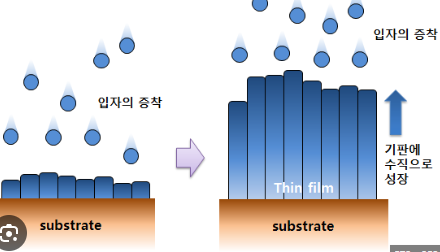

## 메탄올 전기산화를 위한 탄소담지Pt촉매를 위한 NABH4보조 에틸렌글리콜의 환원
>> 탄소담지Pt촉매란?
    탄소기반의 촉매
    촉매 활성 지원체로 탄소 소재를 사용하는 것을 말함
    탄소소재를 표면활성지원체로써 사용해서 Pt입자를 분산시킴으로써 구성된다.
    탄소소재는 높은 열 안정성과 화학적 안정성을 가진다. 그래서 pt촉매는 고온이나 극한 환경에서도 안정성을 유지할 수 있다.
    또한 탄소담지 Pt촉매는 재생과 재사용이 비교적 용이하다. 탄소소재에 고정된 Pt입자는 촉매재생과정에서 비교적 쉽게 제거하고 교체할 수 있다.
>> 촉매 활성 지원체란?
    촉매작용을 돕고 촉매활성을 향상시키는 물질 또는 구조이다
    일부 촉매는 단독으로는 안정성이나 효율성 면에서 제한이 있을 수 있다
    이런 경우에 촉매활성지원체가 촉매입자를 고정시키고 안정성을 부여하는 역할을 한다.
    촉매활성지원체는 또한 촉매입자의 크기, 분산도, 구조등을 제어하고 효율성을 향상시키는데 기여한다.
    일반적으로 다음과 같은 촉매 활성지원체가 존재한다
    1. 산소화/환원 지원체
        산화물 형태로 촉매입자를 지원해서 산소화 반응에 참여하거나, 환원반응에서 산소를 제공하는 역할을 한다.
    2. 표면활성지원체
        촉매입자의 표면적인 활성을 향상시키기 위해 사용되는 지원체로, 활성입자의 크기나 분산도를 제어하고, 반응 표면적을 증가시켜 촉매 활성을 개선시킨다
        ex_silica(SiO2), 탄소 C, 알루미나(Al2O3)등이 있다.
        말그대로 뼈대가 되어주는것 같다.
    3. 분리/지지 지원체
        촉매입자의 분리를 도와주거나 지지하는 역할을 한다.
        촉매 입자의 안정성을 향상시키고 분리된 입자들이 효율적으로 작용할 수 있는 환경을 제공한다.
        ex_ 세라믹재료, 활성탄소
>> 에틸렌 글리콜 환원법이란?
    유기화학에서 일반적으로 사용되는 화학적 환원방법중 하나.
    에틸렌 글리콜 C2H6O2를 환원제로 사용해서 화합물을 환원하는 과정을 말한다.
    에틸렌글리콜은 자체적으로 산화되기 쉬운 성질을 가지고있다. 이 성질을 이용해서 에틸렌글리콜을 산화시키고 동시에 다른 화합물을 환원시킨다.
    일반적으로 환원반응은 화합물에 수소를 추가하거나 산소원자를 제거하는 과정을 포함한다.
    에틸렌글리콜 환원법은 유기화합물의 합성이나 변환, 화학반응의 중간체 생성 등 다양한 화학적 용도로 사용될 수 있다.
    이러한 환원법은 유용한 기능성 화합물의 제조에 이용되고, 유기 화합물의 구조적 변화나 화학반응의 제어에 사용될 수 있다.
>> 금속성장이란?
    금속입자 또는 결정이 크기와 형태를 증가시키는 과정을 의미한다
    금속성장은 일반적으로 용액 또는 가스상태에서 금속입자가 이동해서 크기가 증가하거나 결정 구조가 형성되는 과정을 포함한다.
    금속성장은 일반적으로 확산, 응집, 결정성장의 매커니즘으로 분류된다
    1. 확산성장으로는 금속의 입자표면에서 이동하는 원자 또는 분자의 운동을 의미하며 확산에 따라 입자크기가 변화한다
    2. 응집은 용액 또는 가스상태에서 금속 입자간에 결합이 형성되는 과정으로, 작은 입자들이 모여 큰입자로 성장한다
    3. 결정성장은 금속입자의 결정구조가 형성되는 과정을 의미하며, 결정의 방향성과 구조에 영향을 미친다.
    
>> Pt나노입자의 금속성장 경향과 에틸렌글리콜 환원법을 통한 복합체 생성으로 그 경향을 억제하는 메소드
    Pt나노입자는 일반적으로 서로 집합해서 큰 입자로 성장할 수 있다.
    이는 분산상태의 Pt입자를 형성하는데 있어서 문제가 될 수 있다.
    그러나 에틸렌 글리콜과 NaBH4와의 반응으로 생성된 복합체는 이러한 Pt입자의 성장을 억제하고 분산상태를 유지시키는 역할을 한다.
    부분산화된 이 복합체는 Pt입자의 크기와 크기분포를 좁게 유지시키는 효과적인 안정제 역할을 수행한다.
    에틸렌 글리콜이 Pt촉매의 안정화에 기여하는 이유는
    1. 에틸렌 글리콜이 일반적으로 Pt이온으로 존재하는 Pt전구체를 환원해서 Pt가 나노입자형태로 존재할 수 있도록 만들어주기 때문이다. 이는 입자형성과 그로인한 분산을 도와주는 역할을 하기 때문이다.
#### Abstract
A carbon-supported Pt catalyst (40 wt.% loading) is prepared by a modified ethylene glycol reduction method (Pt–EG-complex). In this procedure, a complex produced by reacting ethylene glycol with sodium borohydride (NaBH4), serves as a reducing agent for the Pt precursor and as a stabilizer for preventing the growth of Pt particles. For purposes of comparison, two types of carbon-supported Pt catalyst (40 wt.% loading) are also prepared by a NaBH4 reduction method, in which the Pt precursor is reduced in a ethylene glycol solution (Pt–EG–NaBH4) and in de-ionized water (Pt–H2O–NaBH4). Analysis by X-ray diffraction and transmission electron microscopy reveal that the Pt–EG-complex catalyst is comprised of highly-dispersed Pt nanoparticles with a uniform size (2. –3.1 nm) on the carbon support, while large Pt particles are observed in the Pt–EG–NaBH4 (3.3–3.6 nm) and Pt–H2O–NaBH4 (5.7–6.2 nm) catalysts. The Pt–EG-complex catalyst has the highest electrochemical surface area and shows the highest catalytic performance for methanol electro-oxidation. © 2006 Elsevier B.V. All rights reserved. 
수정된 에틸렌글리콜 환원법(Pt-EG-복합체)을 사용하여 탄소담지 Pt 촉매(40 중량 %로딩)를 제조합니다. 이 과정에서 에틸렌글리콜과 소듐 보로하이드라이드(NaBH4)를 반응시켜 생산된 복합체는 Pt 전구체의 환원제로서 동작하고, Pt 입자의 성장을 방지하기 위한 안정제 역할을 수행합니다. 비교를 위해 에틸렌글리콜 용액(Pt-EG-NaBH4) 및 탈이온화수(Pt-H2O-NaBH4)에서 Pt 전구체를 환원하는 두 가지 유형의 탄소담지 Pt 촉매(40 중량 %로딩)도 제조됩니다. X선 회절 및 전자 현미경 분석에 의하면, Pt-EG-복합체 촉매는 탄소 지지체 상에서 크기가 균일한 높게 분산된 Pt 나노 입자(2.0-3.1 nm)로 구성되어 있으며, Pt-EG-NaBH4 (3.3-3.6 nm) 및 Pt-H2O-NaBH4 (5.7-6.2 nm) 촉매에서는 큰 Pt 입자가 관찰됩니다. Pt-EG-복합체 촉매는 전기화학적 표면적이 가장 높으며, 메탄올 전기 산화 반응에 대한 최고의 촉매 활성을 나타냅니다. (C) 2006 Elsevier B.V. 판권 소유.
>> 에틸렌 글리콜이 산화되는 성질을 이용해서 다른 화합물을 환원시키는 에틸렌글리콜 환원법으로 carbon-supported platinum catalyst를 만든다.
>>에틸렌글리콜과 NaBH4소듐 보로하이드라이드를 반응싴면 pt전구체의 환원제로써 동작하는 복합체가 생긴다. Pt입자의 성장을 방지하는 안정제 역할을 해준다.

#### Introduction
One of the major problems in the polymer electrolyte fuel cell (PEMFC) systems is the use of expensive Pt-based noble metals as electro catalysts. Although several strategies have been pro- posed for cost reduction [1–3], the preparation of a supported Pt catalyst with a high Pt surface area is an attainable and feasible route to reducing the cost without decreasing the performance of the membrane-electrode assembly (MEA). Carbon-supported catalysts with high Pt loadings (above 20 wt.%) are typically used in MEA fabrication because of their many advantages over counterparts with low Pt loadings [4]. Due to the limited sur- face area of the carbon support, however, the preparation of a carbon-supported Pt catalyst with both high Pt loading and fine Pt dispersion is a challenging task.

고분자 전해질 연료전지 (PEMFC) 시스템에서 주요 문제 중 하나는 비싼 Pt 기반 귀금속을 전기 촉매로 사용하는 것입니다. 비용 절감을 위해 여러 전략이 제안되었지만, 높은 Pt 표면적을 가진 지지체 Pt 촉매의 제조는 비용을 줄이는 데 있어서 실현 가능하고 효과적인 방법입니다. 일반적으로 Pt 함량이 높은 탄소 지지체 촉매 (20 wt.% 이상)가 MEA 제작에 사용되며, 낮은 Pt 함량의 대체품에 비해 여러 장점을 가지고 있습니다. 그러나 탄소 지지체의 표면적이 제한되어 있기 때문에 높은 Pt 함량과 잘 분산된 Pt를 가진 탄소 지지체 Pt 촉매를 제조하는 것은 도전적인 과제입니다.
>> 고분자 전해질 연료전지에서 Pt귀금속을 이용하는게 비용이 많이 든다는 단점이있다. 여러 전략중, Pt표면적을 늘려주는 지지체Pt촉매 제조가 가장 좋은 방법이다. Pt가 20wt이상정도되는 탄소지지체 촉매가 일반적으로 높은 Pt함량을 가지며 MEA제작에 자주 사용된다. 탄소 지지체의 표면적이 제한되어있어, 더 높은 Pt함량과 잘 분산된 Pt를 가진 탄소 지지체 Pt촉매를 제조하는 것은 도전적인 과제이다.
---
Several methods, such as impregnation [5], chemical reduc- tion [6] and electrodeposition [7] have been used for the depo- sition of Pt nanoparticles on carbon supports. Among these methods, the chemical reduction method, which involves the reduction of metal ions by a chemical agent such as ethylene glycol or NaBH4 , has been widely used due to its relative sim- plicity for obtaining a carbon-supported Pt catalyst with a high Pt loading [8,9].It has been reported that a partially-oxidized species, which is thought to originate from a reducing agent such as ethy- lene glycol, serves as an efficient stabilizer in the formation of a finely dispersed carbon-supported Pt catalyst with a nar- row particle-size distribution [10–12]. Therefore, this method is generally considered to be attractive in that an additional stabilizer is not required to prevent metal growth and to dis- perse the reduced metal particles. In addition, considerable attention has also been paid to controlling the process parame- ters, such as the homogeneous heating of the synthesis mixture It should be noted, however, that it is difficult to control syn- thesis conditions in a large-scale batch reactor without the use of an additional process such as microwave irradiation. The repro- ducibility of this method is strongly affected by the synthesis conditions.This study presents a modified ethylene glycol reduc- tion method for the preparation of highly dispersed, carbon- supported Pt catalysts. Specifically, a complex that is produced by reacting ethylene glycol with sodium borohydride (NaBH4 ), serves as a reducing agent for the Pt precursor and, simultane- ously, as a stabilizer for the dispersion of Pt nanoparticles. Since
the entire preparation process can be conducted at room temper- ature, the method promises to be an efficient and reproducible procedure for preparing carbon-supported Pt catalysts with a high Pt dispersion.

높은 Pt 분산을 가진 탄소 지지체 Pt 촉매를 제조하기 위해 침적법 [5], 화학 환원법 [6] 및 전극증착법 [7]과 같은 여러 방법이 사용되어 왔습니다. 이러한 방법 중 화학 환원법은 Pt 나노입자를 화학적인 에이전트인 에틸렌글리콜이나 NaBH4와 같은 환원제에 의해 금속 이온을 환원하는 것을 포함하므로 높은 Pt 함량을 가진 탄소 지지체 Pt 촉매를 얻는 상대적으로 간단한 방법으로 널리 사용되고 있습니다 [8,9]. 에틸렌글리콜과 같은 환원제로부터 유래된 부분 산화된 종류가 Pt 입자의 고도로 분산된 탄소 지지체 Pt 촉매 형성에서 효과적인 안정제로 작용한다는 보고도 있습니다 [10-12]. 따라서, 이 방법은 금속 성장을 방지하고 환원된 금속 입자를 분산시키기 위해 추가적인 안정제가 필요하지 않아 매력적으로 여겨집니다. 또한, 합성 혼합물의 균일한 가열과 같은 공정 변수의 제어에도 상당한 주의가 기울여져 왔습니다. 그러나 대형 배치 반응기에서 마이크로파 조사와 같은 추가 공정 없이 합성 조건을 제어하는 것은 어렵습니다. 이 방법의 재현성은 합성 조건에 강하게 영향을 받습니다.
본 연구는 고도로 분산된 탄소 지지체 Pt 촉매를 제조하기 위한 수정된 에틸렌글리콜 환원법을 제시합니다. 구체적으로, 에틸렌글리콜과 소듐보로하이드라이드 (NaBH4)와의 반응으로 생성되는 복합체는 Pt 전구체에 대한 환원제로서 동시에 Pt 나노입자의 분산을 안정화시키는 역할을 합니다. 전체 제조 과정은 상온에서 수행될 수 있으므로, 이 방법은 높은 Pt 분산을 가진 탄소 지지체 Pt 촉매를 효율적이고 재현 가능한 절차로 제조하는 데 유용할 것으로 기대됩니다.
>> 높은 Pt분산을 가진 탄소 지지체 Pt촉매를 제조하기 위해서는 침적법, 화학환원법, 전극증착법같은 여러 방법을 고안할 수 있는데, 그 중 화학환원법은 다음과 같다. 
>> Pt나노입자. 에틸렌글리콜, NaBH4같은 환원제로 금속이온을 환원시킨다.
그럼으로써 높은 Pt함량을 가진 탄소지지체 Pt촉매를 얻는다.(상대적으로 간단)
>> 에틸렌글리콜같은 환원제로 부터 부분산화한 Pt입자는 고도로 분산된 탄소지지체 Pt촉매 형성에서 효과적인 안정제로 작용한다는 보고도 있다.
>> 따라서 이는 금속성장을 방지하고 환원된 금속입자를 분산시키기 위해 추가적인 안정제가 필요하지 않아 좋다.
>> 구체적으로 에틸렌 글리콜과 NaBH4와의 반응으로 복합체가 생성되면 그것은 Pt전구체에 대한 환원제로서 동시에 Pt나노입자의 분산을 안정화시킨다.

#### Conclusions 
Carbon-supported Pt catalysts have been prepared by the reduction of a Pt precursor in either ethylene glycol solu- tion or de-ionized water using a NaBH4 reducing agent (Pt–EG–NaBH4 and Pt–H2 O–NaBH4 , respectively). A complex (Pt–EG-complex) catalyst has also been produced by react- ing ethylene glycol with NaBH4 which serves as both an efficient stabilizer and a reducing agent. There are uniform- sized Pt particles with a high Pt dispersion in the Pt–EG- complex. On the other hand, no stabilizing effect is observed for the Pt–H2 O–NaBH4 catalyst which has large Pt particles for methanol electro-oxidation, the Pt–EG-complex catalyst with the highest EAS (electrochemical surface area) exhibits the high- est catalytic activity. The behaviour of a carbon-supported Pt catalyst is closely related to its EAS value.
에틸렌글리콜 용액이나 탄소정화수를 사용하여 Pt 전구체를 NaBH4 환원제를 이용하여 환원함으로써 탄소 지지체 Pt 촉매를 제조했습니다. 각각 Pt-EG-NaBH4 및 Pt-H2O-NaBH4로 명명되는 촉매입니다. 에틸렌글리콜과 NaBH4을 반응시켜 생성된 복합체인 Pt-EG-복합체 촉매는 효과적인 안정제 및 환원제로 작용합니다. Pt-EG-복합체에서는 고도로 분산된 크기가 균일한 Pt 입자가 존재합니다. 반면, 큰 Pt 입자를 가진 Pt-H2O-NaBH4 촉매에는 안정화 효과가 관찰되지 않습니다. EAS (전기화학적 표면적)이 가장 높은 Pt-EG-복합체 촉매는 메탄올 전기 산화 반응에 가장 높은 촉매 활성을 나타냅니다. 탄소 지지체 Pt 촉매의 특성은 EAS 값과 밀접한 관련이 있습니다.
>> 에틸렌 글리콜 용액과 탄소정화수를 이용하는 경우 각각에 대해서 NaBH4를 환원제로 이용해서 Pt전구체의 탄소지지체 Pt촉매를 제조했다. Pt-EG-NaBH4와 Pt-H2O-NaBH4로 명명되는 촉매이다. 
>> 이때 Pt-H2O-NaBH4는 큰 Pt입자를 가진 복합체가 형성되고 안정화 효과가 관찰되지 않은 반면에, 에틸렌글리콜을 이용한 경우에는 고도로 분산된 크기가 균일한 Pt입자가 존재하며 가장 높은 전기화학적 표면적을 가지는 안정화효과를 가졌다. 비교군과의 비교로도 명확하게 EG복합체가 더 촉매활성이 좋다는 것이 드러난다. 또한 탄소지지체 Pt촉매의 특성은 전기화학적표면적인 EAS값과 밀접한 관련이 있다는 것을 알 수 있다.
>> 결론적으로 에틸렌글리콜을 이용해서 NaBH4와 함께 환원시킨 Pt촉매는
EAS가 가장 높은 형태의 촉매활성도를 가지는 탄소지지체 Pt촉매 복합체를 가지게된다.