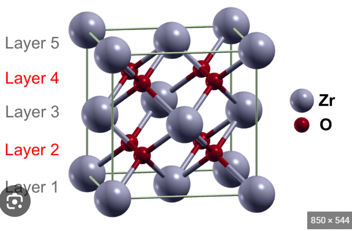

## Metal-organic framework-derived ZrO2 on N/S-doped porous carbons for mechanistic and kinetic inspection of catalytic H2O2 homolysis
## 금속 유기 프레임워크로부터 유도된 N/S 도포된 다공성 탄소 위에 있는 ZrO2의 촉매적 H2O2 동질분해의 기구적 및 운동학적 검사
+ 금속 유기 프레임워크로부터 유도된 N/S도포된 다공성 탄소 -> 위의 ZrO2의 
+ 촉매적 H2O2동질분해
+ 에 대한 기구적 , 운동학적 검사
>> MOF(metal_organic_framework) : 금속유기분자체 -> 분자내부에 빈 공간을 갖는 다공성 물질 / 그 빈공간을이용해, 기체 흡착과 분리 등의 응용이 가능하다.
>> N/S도포 : 
    정의 : N질소 및 S황원자를 다른 물질의 표면에 표면적으로 도포하는 과정
    효과 : 일반적으로 다양한 촉매물질의 표면 특성을 개선하고 촉매의 활성 및 선택성을 향상시키기 위해 수행
>> Zr 지르코늄 : 
    원자번호 : 40
    주기율표 제 4족에 속하는 금속원소
    특징:
        천연에 풍부하다
        공업적으로 마그네슘을 이용한 크롤법에 의해 제조하며 내식성이 매우 좋아 원자로의 재료로서 많이 이용된다.
>> ZrO2 이산화 지르코늄 : 
    흰색결정
    물에는 거의 녹지 않음
    
>> H2O2 동질분해
    과산화수소 분자가 동일한 분자로 분해되는 화학반응
    2 H2O2 → 2 H2O + O2
    자발적인 반응
    반응속도는 온도, pH, 촉매 등 여러가지 조건에따라 변할 수 있다.
    H2O2 동질분해는 촉매에 의해 가속화될 수 있다.
    촉매의 종류와 특성에 따라 반응속도와 선택성이 변할 수 있다.
>> 기구적 검사 : 
    화학반응이나
+ 제목요약 : 금속 유기 프레임워크(MOF)로부터 N/S도포된 다공성 탄소를 유도. 그러한 다공성 탄소위에 ZrO2이산화지르코늄이 H2O2를 동질분해하는 과정의 기구적 운동학적 검사를하는 논문
+ 제목 요약 2 : 금속 유기 프레임워크(MOF)로부터 얻은 다공성 탄소(N/S도포된) 위에 있는 ZrO2이산화 지르코늄이 H2O2를 동질분해하는 과정의 기구적 운동학적 검사를 하는 논문

## Introduction
#### 알야야할 것. 오비탈, 금속산화물, 산염기, 라디칼이란?, *OOH, d-블록 전이금속 산화물, 산화환원
H2O2 splits into •OH, •OOH, and/or O2•- in an aqueous environment via multiple pathways, where d-block transition metal oxides can activate H2O2 scission for decomposing aqueous pollutants [1,2]. In particular, phenol is difficult to be radicalized via electron loss owing to its high ionization potential and thereby is prone to be destabilized via radical addition/H• abstraction rather than via electron migration to radical [3]. In this sense, •OH is suitable for degrading phenol because of its proclivity for addition/H• abstraction rather than electron transfer in decomposing contaminants [4–7]. Meanwhile, most transition metal oxides bear(포함하다) Lewis acidic surface metals (M_REDUCIBLE) with valence states(원자가상태) (δ) of +2/+3 (e.g., Fe2+, Co2+, Ni2+, or Mn2+/3+) [1,2].
These metals are reducible and possess partially occupied d-orbitals that can accept electrons when adjacent lattice O atoms are released. (M_REDUCIBLE δ+ -O2--M_REDUCIBLE δ+ → MREDUCIBLE (δ− 1)+  OV-MREDUCIBLE (δ− 1)+ + 1/2O2, where OV denotes oxygen vacancy.) [8–11] 
Similarly, the d-orbitals of MREDUCIBLE δ+ can also accept lone electron pairs from the O atoms of H2O2 to form MREDUCIBLE δ+ -H2O2 [5–7,12–14]. 
Transfer of the resulting d-electron to H2O2 leads to heterolytic H2O2 dissection, producing • OH and OH− in tandem with MREDUCIBLE (δ+1)+ (MREDUCIBLE δ+ -H2O2 → MREDUCIBLE (δ+1)+ + • OH + OH− ) [5–7,12–14]. In particular, • OH and •OOH possess greater reduction potentials (≥1.8 V) than O2 •- (− 0.2 V) and a higher tendency to withdraw electron from contaminants than O2 •- , thereby enhancing the radicalization of pollutants and their degradation into CO2/H2O over O2 •- [15,16]. Therefore, MREDUCIBLE (δ+1)+ should either be recovered to MREDUCIBLE δ+ for recurrent •OH generation or readily generate • OOH as a substitute for • OH. In addition, H2O2 serves to produce MREDUCIBLE(δ+1)+-H2O2, whereupon H2O2 donates an electron to reduce MREDUCIBLE (δ+1)+ , while being converted to H+ and • OOH, both of which are released into the aqueous environment (MREDUCIBLE (δ+1)+ -H2O2 →MREDUCIBLE δ+ + • OOH + H+) [13,14]. However, • OOH tends to transform into O2 •- and H+ at pH values of >4.8 ( • OOH → O2 •- + H+) [17], although O2 •- can reduce MREDUCIBLE (δ+1)+ via electron donation (MREDUCIBLE (δ+1)+ + O2 •- → MREDUCIBLE δ+ + O2) [13,18]. Despite producing • OH for pollutant decomposition, H2O2 cleavage on MREDUCIBLE δ+ species faces drawbacks such as decreased • OH productivity due to the additional H2O2 consumption pathway to regenerate MREDUCIBLE δ+ and the loss of • OOH via deprotonation [13,14,17,18]. 
>> *OH 와 -OH의 차이
    *OH는 올로일기기 
        이중결합된 산소와 수소원자로 구성된 기기
    -OH는 알코올 기능기
        하나의 단일 결합된 산소와 하나의 수소로 구성된 기기
>> OH-라디칼이란?:
    플라즈마 상태에서 발생하는 산소 음이온계물질을 말한다
    고도산화공정을 통해 생성할 수 있으며 자연계에서도 드물게 발견된다.
    OH-라디칼의 특징
    1. 수산기(OH)에 에너지를 가해 생성되는 이종의 산소음이온계 물질로 산화력이 뛰어나고 인체에 무해하다.
    2. 다른물질과 반응하려는 성질이 매우 높은 물질이며, 강력한 산화*소독 기능으로 다양한 오염물질과 반응해서 산화*제거할 수 있음.(오염물질에 반응시킴으로 응용하는구나.)
    3. 현존물질중에서 F(불소)다음으로 산화력이 높으며 오존O3와 염소 Cl2보다도 강력함을 의미한다.
    4. 오염물질을 제거한 후 잔존 OH-Radical은 물과 산소로 자연분해된다.
    5. 전세계적으로 수질정화에 이용
    6. 오염물질을 제거한 후에는 일반 폭포수보다 약 10배많은 음이온으로 환원되어 BOD, COD등을 개선하는 친환경 천연물질이다.
>> 플라즈마 상태란? 
    가스가 고온과 고에너지 상태에서 이온화되어 전기적으로 중성체와 이온으로 이루어진 상태.
    고체 액체 기체와 다른 특수한 상태를 의미
    플라즈마는 기체로부터 전기에너지를 공급받아 이온과 자유전자로 이루어진 전기중성체 형태로 변한다.
    이러한 상태에서는 전자와 이온들이 강한 상호작용을 하며, 전기장과 자기장에 의해 영향을 받는다. 
    플라즈마는 전기적으로 중성체와 이온화된 입자들이 서로 충돌하고 상호작용하며 다양한 화학반응과 전기적 현상을 포함한 다양한 물리적 현상을 보인다.
>>*OOH 히드록시퍼옥사일 라디칼이란?
    HO2*로 표기된다.
    고체 액체 기체 등 다양한 상태에서 존재할 수 있다
    반응성이 매우 높은 화학종이다
    산소와 수소의 결합을 포함한다
    그래서 산화 및 환원반응에 관여할 수 있다. 
    *OOH는 많은 촉매반응에서 중요한 역할을 한다.
    촉매가 *OOH를 생성하고 분해시킴으로써 화학반응에 참여할 수 있다.
    *OOH는 다양한 화학반응 경로를 통해 산화, 환원 , 라디칼추가, 수소 추출등의 반응을 수행할 수 있다.
>>O2*-란?
    산소음이온 또는 슈퍼옥사이드 이온을 나타낸다
    이 이온은 산소분자(O2)에서 하나의 전자를 얻어옴으로써 생성된다
    그 결과, O2*-이온은 하나의 부가전자를 갖게되어 단일 음전하를 가지게 된다.
    O2*-이온은 화학반응에서 중요한 역할을 한다.
    산소이온은 화학적으로 반응성이 높아 다른 분자들과 반응해서 자유라디칼인 HO*수산화 라디칼을 생성할 수 있다.
>> d블록 전이금속산화물이란?
    d-블록 전이 금속 산화물은 d-블록에 속하는 전이 금속 원소와 산소의 화합물을 말한다. d-블록 전이 금속은 주기율표에서 3부터 12까지의 원소를 의미하며, 이들은 전자를 d-궤도에 가지고 있다. 
    이러한 전이금속들은 다양한 화학적 특성들을 가지며 많은 경우 산화물로 존재한다.
>> 가수성 표면금속이란(surface plasmon metal)?
    표면 플라즈몬 공명을 경험하는 금속
    표면 플라즈몬은 금속표면에서 전자와 광자의 상호작용으로 발생하는 현상
    금속의 표면에 광파가 닿으면 자유전자들이 표면에서 진동하며, 이러한 진동은 광자와 상호작용하게 된다. 이 상호작용은 특정 주파수 또는 파장에서 최대로 강화되며, 이를 표면 플라즈몬 공명이라고 한다. 이러한 현상은 주로 금속 나노입자 또는 얇은 금속막으로 이루어진 표면에서 발생한다.
    가수성 표면금속은 표면 플라즈몬 공명을 가장 잘 경험하는 금속으로 알려져 있다. 주로 금, 은, 구리등이 가수성 표면금속으로 사용된다.
>> 가수성이란?
    광과 전자의 상호작용에 기반한 연구분야
    표면 플라즈몬이라고도 불리는 현상
    가수성은 금속 입자 또는 표면에서 전자와 광자의 플라즈몬 공명이 발생하는 현상을 연구하고 응용하는 분야.
>> 플라즈몬이란?
    금속표면에서 전자와 광자가 결합하여 발생하는 특수한 형태의 퀀텀(양자)현자이다. 이는 금속 입자 또는 표면에서 전자들이 광자와 상호작용하며 나타난다
    금속 입자의 크기, 모양, 밀도 등에 따라 플라즈몬 공명의 특성이 달라진다.
>> MREDUCIBLE이란?
    "reducible metal"의 약어로 환원가능한 금속을 나타낸다. 
    일반적으로 전이금속 산화물의 표면에 존재하는 환원가능한 금속 원자를 가리킨다.
    환원가능한 금속은 화학반응에서 전자를 받아들일 수 있으며, 이를 통해 다양한 환원반응을 촉진하거나 참여할 수 있다.
>> lewis acid surface metal
    루이스산을 촉매로 사용하는 표면에 존재하는 금속
    루이스산은 전자를 받아들이는 능력을 가진 화학물질
    반응중에 전자를 공유하거나 받아들이는데 중요한 역할을 함.
    표면금속은 금속이나 금속산화물로 구성되며, 표면에 노출된 금속원자는 화학반응에 참여할 수 있는 활성사이트를 형성한다.

    루이스산성 표면금속은 반응에 참여하는 분자나 이온을 화학적으로 결합시키고 반응속도를 증가시키는 촉매로 작용한다.
    특히, 루이스 산 센터로 작용해서 전자를 받아들이고 전자부족 기관으로부터 전자를 끌어당긴다
    이렇게 받아들인 전자는 화학반응의 중간단계에서 중요한 역할을 수행하며, 원하는 생성물을 형성하는 반응을 촉진한다
>> 루이스산 / 루이스염기
    루이스산은 전자를 받아들이는 능력을 말하고/H+를 주거나
    루이스염기는 전자를 기부하는 능력을 말한다/H+를 받거나
>> 루이스산 표면금속
    전이금속이나 전이금속의 화합물은 전자를 받아들일 수 있는 능력인 루이스 산인 금속이다
    표면에 노출된 원자들이 루이스 산으로 작용하는 능력을 가진다.
    원자가 상태가 +2+3인 경우 전자를 받아들일수 있는 능력을 가지고 루이스산표면금속으로 작용한다.
>> 산화 / 환원
    산화 : 산소를 받아들이거나 전자를 기부하는것, 수소를 기부하는 것
    환원 : 산소를 기부하거나 전자를 받아들이는것, 수소를 기부하는 것

    루이스 산(전자를 받아들인다.) == 환원가능(전자를 받아들인다.)

H2O2는 수용액 환경에서 다양한 경로로 *OH , *OOH나  *O2-로 분해된다
산화전이금속이 수용액오염물질을 분리하기 위한 H2O2분해를 활성화한다

패놀은 전자를 잃어버리게 하는 방법으로 라디칼화하기 힘들다
왜냐하면 그것의 높은 이온화에너지떄문에
그렇기때문에 H*라디칼을 추가하는 방법을 통해서 불안정화시키는 경향이 있다

이런 느낌으로, OH*는 그것의 추가성향떄문에 페놀을 분해하는데 적합하다 
오염물질 분해를 위한 전자전달보다

한편으로 이야기는 바뀌어
대부분의 산화전이금속은 +2나 +3의 원자가상태의 루이스산성표면금속을 가진다
이 금속들은 환원가능하고 인접한 격자 O원자가 방출될 떄 전자를 수용할 수 있는 부분적으로 점유된 d-오비탈을 소유한다
인접 O원자가 비게될때 전자를 수용할 수 있는 부분적으로 점유된 d오비탈을 소유한다.