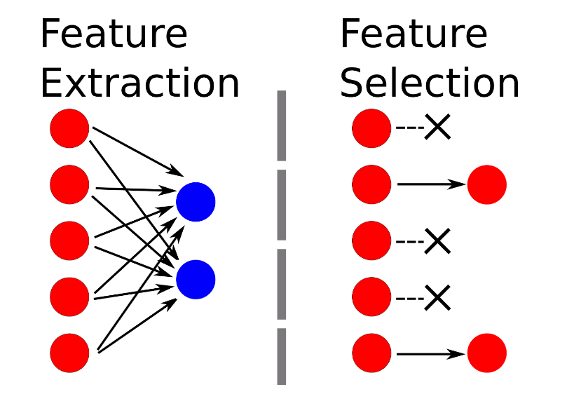
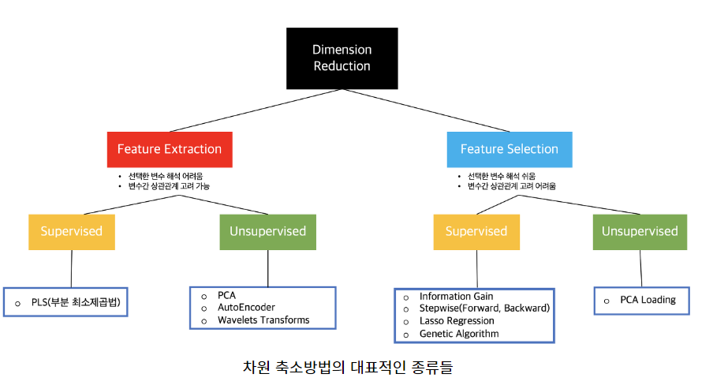

추출은 기존의 것들을 무엇인가 변형을 취해 새로운 것을 만들어내는 의미
선택은 기존의 것들을 그대로 둔 채 하나를 선택하는 것을 의미

추출과 선택, 각 방법에 있어서 SuperVised와 UnSuperVised의 차이점?(지도와 비지도)
종속변수 Y의 값을 고려해서 변수를 추출(또는 선택)하는지의 여부.

차원축소방법에는 위 사진처럼 가장먼저 추출과 선택으로 나뉘고
그 뒤에 각 방법에 대해서 지도와 비지도로 나뉜다

두번째 분할조건인 지도와 비지도의 차이는 Y값을 고려한다는 말인데, Y값을 고려한다는 말은 Y값의 분산을 활용한다는 것을 의미한다

### 추출 방법의 지도방법의 대표적인 예시 : PLS
부분최소제곱법이라고 하며, 지도적인 방법으로 Y값을 고려해서 차원을 축소하게 된다. Y값의 분산을 활용한다는 것인데, PLS는 X라는 독립변수들의 선형결합과 Y라는 종속변수 이 2개간의 공분산을 최대화하는 새로운 변수로 추출하는 것을 의미한다.

#### PLSR
+ 변수 간 상관관계 식별
+ 다중 공선성 처리
    주성분 분석(PCA)와 회귀분석을 결합하면서

### PLSR과  PCA와의 비교
PCA와 같은 X변수들 간의 일반적인 선형결합으로 추출된 새로운 변수가 설명하지 못하는 부분에 반복적인 최소제곱법을 활용하는 것이 PLS이다.
---
### 기타 정리
+ 회귀분석이란?
변수들 사이의 관계를 "모델링"하는 기법

+ 다중 공선성 문제란?Multicollinearity
다중공선성은 일반적으로 회귀분석에서 등장하는 단어이다.
어떤 독립변수가 다른 독립변수들과 완벽한 선형 독립이 아닌 경우를 뜻한다.
즉, 한 독립변수가 특정 독립변수와 상관정도가 매우 높을 떄 완벽한 선형독립이 되지못하는데, 이는 데이터 분석을 할 떄 분석파악에 큰 문제가 된다.
>> 우선 독립변수의 영향력을 정확하게 추정하기가 어렵다
상관관계가 높은 독립변수들 중 특정 독립변수가 모델에 포함되면, 이미 그 독립변수가 설명할것들을 많이 설명해 놓은 상태이기 때문에, 다른 상관관계가 높은 독립변수들은 추후 모델에 추가된다해도 영향력이 작아지게 된다.
>> 또한 개별적인 영향력을 명확하게 해석하기 어려워지고 결과적으로 모델해석의 어려움을 겪는다
>> 변수선택의 어려움 또한 겪는데, 이는 어떤 독립변수를 모델에 포함시킬지 결정하기 어려울 수 있기 떄문이다.

+ 다중공선성 문제 해결방법
>>> 변수제거 : 상관관계가 높은 독립변수들 중 일부를 제거하여 다중 공선성을 완화한다
>>> 변수 변환 : 독립변수들을 표준화하거나 정규화하여 다중공선성을 줄일 수 있다. 예를들어 변수들을 중심화하거나 표준편차로 나누는 등의 변환을 수행할 수 있다
>>> 변수결합 : 상관관계가 높은 변수들을 아예 결합시켜 새로운 변수를 생성한다. 그럼으로 독립변수들 간의 공통적인 영향을 하나의 변수로 대표할 수 있다.

+ 선형독립
>> 어떤 벡터도 다른 벡터들의 선형 결합으로 표현할 수 없으면 선형독립이다
+ 주성분분석 (PCA)란?
    다중공선성 처리에 유용한 방법 중 하나로