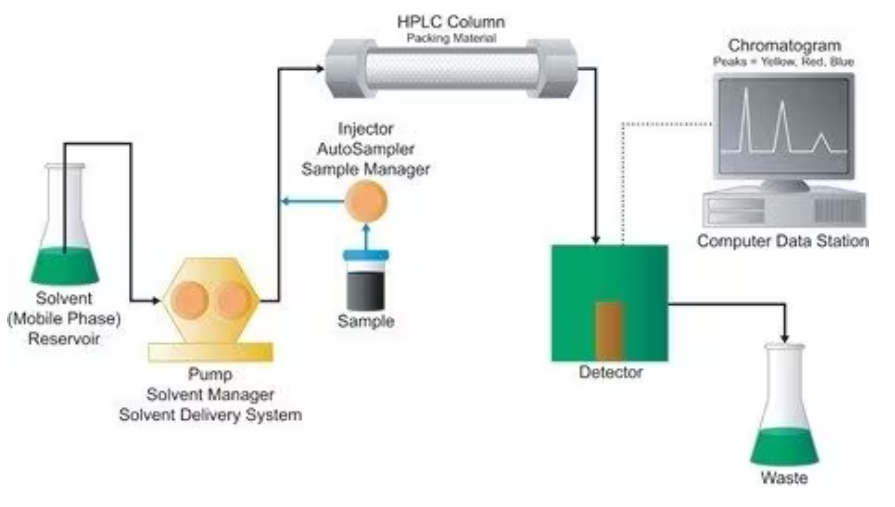
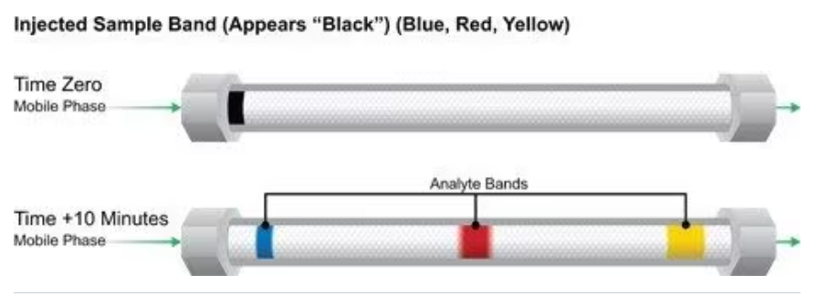
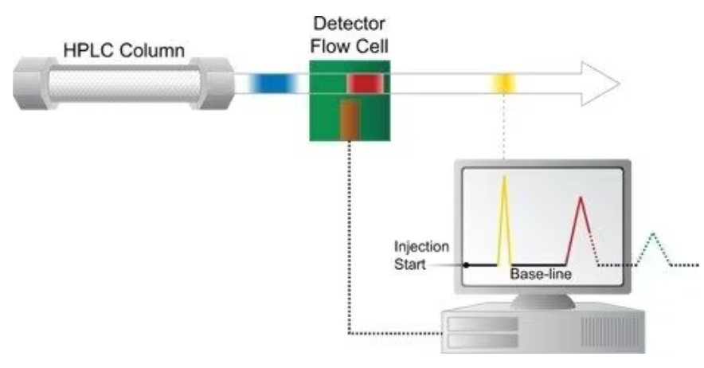

>## TiO2만들기(ver.1)(공기와의 열처리) [0705일 이어서]
* 만들어진 TiO(OH)2를 열처리해서 TiO2로 만들기
* 우리 연구실의 열소성기를 이용
* 방법
    0. 준비물 준비
    * 유리투브
        
    1. (유리)튜브에 TiOOH가루 1.2그램을 담는다
    
    
    2. 열소성기 안에 튜브를 넣는다
        넣을 때는 긴 쇠막대를 이용해서 중간부분까지 밀어넣기
    3. 고밀도 공기(99.999%의 N2, O2) 탱크의 관을 소성기의 관에 연결하고 꽉 조인다.
    4. 소성기를 키고, 설정할 조건에 맞게 기계를 설정
    <video src="KakaoTalk_20230706_142806743.mp4" controls title="Title"></video>
    <video src="KakaoTalk_20230706_142817320.mp4" controls title="Title"></video>
    <video src="KakaoTalk_20230706_142441559.mp4" controls title="Title"></video>
    5. 소성기 작업이 끝나면 결과물인 TiO2가 담긴 튜브를 쇠막대로 꺼내기
    6. 튜브속의 TiO2들을 빈통에 담는다
    7. 빈 통에 TiO2의 상세 실험조건들이 담긴 종이를 붙힌다
    8. 튜브 Di로 닦고 오븐에 말리고 마무리

## TiO2만들기 열처리가 끝나 TiO2분말이 된것을 원하는 직경 범위내의 입자로 만들기
* 오늘은 300마이크로미터에서 425마이크로미터 필터를 써서, 300 ~ 425마이크로미터 범위의 입자를 채털기함
* 준비물 : 채 ,압축기, TiO2분말, 입자 담을 빈통, 막자사발, 절구통, 프레스몰드
* 방법 : 
    1. 원하는 직경 범위의 채들, 프레스 몰드, TiO2분말, 입자담을 빈통, 막자사발, 절구통을 준비해서 알코올로 한번 소독한다
    2. 프레스 몰드에 적정량의 분말을 담고 고루 펴준뒤에 프레스몰드를 닫고, 압축기에 넣어준다.
    3. 압축기에서 압력 3.5에 설정해두고 40초간 기다린다.
    4. 압축이 완료된 프레스 몰드를 가지고 실험테이블로 가서 딱딱하게 뭉친 TiO2를 털어내고 적절히 갈아 채에 골라지게한다.
    5. 반복
* 뒷정리 및 마무리 방법
    1. 골라지지 않은 미세 TiO2들은 다시 다른 통에 담아둔다

## 촉매속도
블랭크제거 - 전극에 의해서 분해된것을 뺴줘야함
## HPLC찍은 TiO2촉매로 분해한 오염수 데이터 분석하는 방법 (with excel)
* 첨부된 엑셀파일 참조
* 방법 
    1. 먼저 HPLC장비 옆의 컴퓨터를 켜서 소프트웨어에서 측정한 Area값을 확인하고, 옮겨적는다
    2. 내 컴퓨터의 공간에 엑셀파일을 하나 만들고, AREA값을 다시 옮겨적는다(샘플, Blank데이터 모두)
    3. 각 데이터별(반응n, blank)로, 필요한 수식을 적용한 값을 컬럼으로 추가한다
        * C/C0 
            Area(t min) / Area(0min)
        * -ln(C/C0)
            -ln( Area(t min) / Area(0min) )
        * conversion
            ( 1 - C/C0 ) * 100
    4. 데이터군들의 평균과 표준편차를 구한다(구하는 공식은 사진에 나와있다.)
        모집단 표준편차 STDEV.P 수식을 사용한다
    5. 촉매 + 블랭크데이터가 합쳐진 실험결과에서, 블랭크데이터를 추출해 없애는 수식을 쓴다
        * conversion : 촉매반응 Average_conversion - 블랭크데이터 Average_conversion 
        * -ln : 촉매반응 Average_ln - 블랭크데이터 Average_ln
        * conversion - stdev : 촉매반응 Average_conversion과 블랭크데이터 Average_conversion의 표준편차 (y = a - b꼴의 표준편차)
        * -ln - stdev : 촉매반응 Average_ln과 블랭크데이터 Average_ln의 표준편차

    6. 5번에서 얻은 -ln데이터를 기반으로 시간-ln그래프를 그린다 (scatter plot을 하고 회귀선, 신뢰도를 구한다)
    7. 데이터분석으로 회귀분석 통계량들을 구한다.
    8. 그래프의 계수를 구하고, 촉매량과 오염수농도를 가지고 -r_pollutant와 stdev -r_pollutant를 구한다.
        * 계수 * 오염수 농도 / 카탈리스트 g/L
        ** 전극에 촉매를 바른 형태더라도 g을 이용해서 함.
### TC / IC 가감법 && NPOC (TOC에서 측정분석방법)

### 스캐빈저
혼합물 중에서 일부 물질만을 제거하려고 첨가제를 넣는 일. 또는 그 첨가제.
* 라디칼 스캐빈저
    라디칼은 생체 중에서 여러가지 성분과 반응하고 이들을 파괴하거나 불활성화한다. 특히 라디칼의 공격을 받은 불포화지방산으로부터 라디칼이 생기고, 이 라디칼에는 즉시 산소가 결합하여 peroxyradical로 된다. 이것이 다른 분자로부터 수소원자를 취하여 hydroperoxide로 되며, 이는 연쇄반응으로 진행된다. 이것을 절단하기 위해서는 peroxyradical에 수소원자를 주어 안정한 hydroperoxide로 되는 산화방지제가 필요하다. 지방질에 대하여는, 산화방지제로서 비교적 약한 환원제인 tocopherol 등의 페놀화합물이 유효하다. 이와 같이 라디칼에 수소원자를 주어 라디칼을 소거하는 것이 스캐빈저이다. 활성 산소종 등의 라디칼에 대해서는 강력한 환원제인 ascorbic acid, glutathione, 요산 등이 스캐빈저로서 작용한다.
* 메탄올 라디칼 스캐빈저 
    * 메탄올 라디칼 스캐버저(Methanol Radical Scavenger)는 화학 반응에서 자유 라디칼을 제거하는 물질을 말합니다. 자유 라디칼은 하나의 전자가 결합되어 있으며, 화학 반응에서 고에너지 상태로써 활동합니다. 이러한 라디칼은 종종 산화 및 화학적 손상을 초래할 수 있습니다.

    * 메탄올 라디칼 스캐버저는 반응 중에 생성되는 자유 라디칼과 반응하여 안정적인 중간체를 형성하는 물질입니다. 이를 통해 자유 라디칼의 활동을 억제하고 반응의 부작용을 최소화합니다. 메탄올은 라디칼들과 반응하여 메탄올 라디칼을 생성하고, 이 메탄올 라디칼은 자유 라디칼들과 반응하여 안정한 중간체를 형성합니다.

    * 메탄올 라디칼 스캐버저는 다양한 화학 및 생물학적 응용에서 사용될 수 있습니다. 예를 들어, 항산화 작용을 통해 자유 라디칼로 인한 산화를 방지하고, 반응의 선택성과 효율성을 향상시키는 역할을 할 수 있습니다. 또한, 화장품 및 의약품 제조 과정에서 안정성을 향상시키기 위해 메탄올 라디칼 스캐버저를 사용할 수도 있습니다.

    * 요약하자면, 메탄올 라디칼 스캐버저는 자유 라디칼을 제거하고 안정된 중간체를 형성하여 화학 반응의 안정성과 효율성을 개선하는 역할을 합니다.
    >> 메탄올 라디칼 스캐버저는 자유라디칼을 제거하고 중간체를 형성해서 화학반응의 안정성과 효율성을 개선하는 역할을 한다.
# HPLC 다이어그램 High Performance Liquid Chromatography 

기본적인 고성능 액체 크로마토그래피[HPLC] 시스템의 구성 요소를 그림 E의 단순화시킨 다이어그램에서 볼 수 있습니다.

* 저장 용기 -> 용매[움직이기 때문에 이동상이라고 함]가 담긴다. 
* 고압 펌프[용매 이송 시스템 또는 Solvent Manager] -> 일반적으로 분당 밀리리터 단위로 지정된 이동상의 유속을 생성하고 측정하는 데 사용.
* 주입기[Sample Manager 또는 자동 샘플 주입기] -> 샘플을 HPLC 컬럼으로 운반하는 연속적으로 흐르는 이동상 스트림에 샘플을 도입[주입]할 수 있습니다. 
* 컬럼 -> 분리에 필요한 크로마토그래피 충전재가 들어 있음
* 충전재 -> 이 충전재는 컬럼 하드웨어에 의해 제자리에 고정되기 때문에 고정상이라고 합니다.

* 검출기 -> HPLC 컬럼에서 용리되는 분리된 화합물 띠를 보려면 필요[대부분의 화합물은 색상이 없으므로 눈으로 확인할 수 없음]. 
* 이동상은 검출기를 빠져나와 필요에 따라 폐기물로 보내지거나 수집될 수 있습니다. 
* 이동상에 분리된 화합물 띠가 포함된 경우 HPLC는 추가 연구를 위해 정제된 화합물을 포함하는 용리액의 이 분획을 수집할 수 있습니다. 
* 이것을 분취용 크로마토그래피[HPLC 스케일 섹션에서 논의]라고 합니다.

* 펌프, 주입기, 컬럼 및 검출기 구성 요소를 상호 연결하여 이동상, 샘플 및 분리된 화합물 띠를 위한 도관을 구성하기 위해 고압 튜브와 피팅이 사용됩니다.
* 검출기는 HPLC 시스템 구성 요소인 컴퓨터 데이터 스테이션에 연결됩니다. 
* 컴퓨터 데이터 스테이션 -> 디스플레이에 크로마토그램을 생성하고 샘플 성분의 농도를 식별 및 정량화하는 데 필요한 전기 신호를 기록합니다(그림 F 참조). 
* 샘플 화합물의 특성은 매우 상이하기 때문에 여러 유형의 검출기가 개발되었습니다.
    ex 1 : 화합물이 자외선을 흡수할 수 있는 경우 UV 흡광도 검출기가 사용됩니다. 
    ex 2 : 화합물이 형광을 나타내면 형광 검출기가 사용됩니다. 
    ex 3 : 화합물에 이러한 특성이 모두 없는 경우 증기화 광산란 검출기[ELSD]와 같은 보다 보편적인 검출기가 사용됩니다. 
    
    가장 강력한 방식은 여러 검출기를 직렬로 사용하는 것입니다. 
    예를 들어, UV 및/또는 ELSD 검출기를 질량분석기[MS]와 함께 사용하여 크로마토그래피 분리 결과를 분석할 수 있습니다. 이는 단일 주입을 통해 분석물에 대한 보다 종합적인 정보를 제공합니다. 
    LC-MS -> 질량분석기를 HPLC 시스템에 연결하는 방식
* HPLC 작동
    * 그림 G의 다이어그램을 보면 샘플에 포함된 화합물을 분리하는 방식을 보다 쉽게 이해할 수 있습니다.
    
    * 이동상은 왼쪽에서 컬럼으로 들어가고 입자층을 통과하여 오른쪽으로 나옵니다. 
    
    * 흐름 방향은 녹색 화살표로 표시됩니다. 
    * 먼저 상단 이미지를 살펴보겠습니다. 
        * 이것은 샘플이 컬럼에 들어가 띠를 형성하기 시작할 때인 시간 0[주입 순간]에서의 컬럼을 나타냅니다. 
        * 여기에 표시된 샘플은 노란색, 빨간색 및 파란색 염료의 혼합물로, 컬럼 주입구에서 하나의 검정색 띠로 나타납니다. 
        * [실제로 이 샘플은 용매에 용해될 수 있는 어떤 것이든 될 수 있습니다. 일반적으로 화합물은 무색이고 컬럼 벽은 불투명하므로 분리된 화합물이 용리될 때 이를 확인하기 위해 검출기가 필요합니다.]
    * 이동상이 충전재 입자를 통해 몇 분 동안 지속적으로 꾸준히 흐르면 개별 염료가 서로 다른 속도로 별도의 띠를 형성하면서 이동했음을 알 수 있습니다. 
    * 이것은 이동상과 고정상 사이에 경쟁적으로 각각의 염료나 분석물을 끌어들이기 때문에 생기는 현상입니다. 노란색 염료 띠가 가장 빠르게 움직이며 곧 컬럼에서 용리됩니다. 
    * 노란색 염료는 다른 염료보다 이동상을 더 오래 머무릅니다[더 강하게 끌림]. 따라서 이동상의 속도에 가까운 빠른 속도로 이동합니다. 
    * 파란색 염료 띠는 이동상보다 충전재에 더 끌립니다. 입자에 더 강하게 끌리기 때문에 이동 속도가 상당히 느려집니다. 
        * 즉, 이 샘플 혼합물에서 가장 오래 머무르는 화합물입니다.
    * 빨간색 염료 띠는 이동상에 대해 중간의 끌림을 가지므로 컬럼에서 중간 속도로 이동합니다. 
    * 각 염료 띠는 다른 속도로 움직이기 때문에 크로마토그래피 원리에 따라 분리할 수 있습니다.
* 검출기 개요
    * 분리된 염료 띠가 컬럼을 나가면 즉시 검출기로 전달됩니다.
    * 검출기에는 이동상의 백그라운드에 대비시켜 분리된 각 화합물 띠를 관찰[검출]하는 플로우 셀이 들어 있습니다[그림 H 참조]. [실제로, 일반적인 HPLC 분석 농도에서 많은 화합물의 용액은 무색입니다.]
    * 적절한 검출기는 화합물의 존재를 감지하고 해당 전기 신호를 컴퓨터 데이터 스테이션으로 보낼 수 있습니다. 
    * 여러 가지 유형의 검출기를 선택할 수 있는데, 앞서 논의한 바와 같이 분리 및 분석해야 하는 화합물의 특성 및 농도를 고려하여 결정됩니다.
    그림 H: 피크가 생성되는 방식

* 크로마토그램 개요
    * 크로마토그램은 HPLC 시스템에서 화학적으로[크로마토그래피 원리에 따라] 이루어지는 분리를 나타냅니다. 
    * 베이스라인에서 상승하는 일련의 피크가 시간 축을 따라 그려집니다. 
    * 각 피크는 다른 화합물에 대한 검출기 반응을 나타냅니다. 크로마토그램은 컴퓨터 데이터 스테이션에서 그래프로 그려집니다[그림 H 참조].
    그림 H: 피크가 생성되는 방식
    * 그림 H에서 노란색 띠는 검출기 플로우 셀을 완전히 통과했고, 생성된 전기 신호는 컴퓨터 데이터 스테이션으로 전송되었습니다.
    * 크로마토그램 결과가 화면에 그려지기 시작합니다. 
        * 크로마토그램은 샘플이 처음 주입될 때 시작되고 화면 하단 근처에 설정된 직선으로 시작됩니다. 
    * 이것을 베이스라인이라고 합니다. 
        * 시간이 지남에 따라 여기에 플로우 셀을 통과하는 순수한 이동상이 나타납니다. 
    * 노란색 분석물 띠가 플로우 셀을 통과하면 더 강한 신호가 컴퓨터로 전송됩니다. 
        * 샘플 띠의 노란색 염료 농도에 비례하여 위쪽으로 향했다가 아래로 내려오는 곡선이 형성됩니다.
    * 이렇게 크로마토그램에 피크가 생성됩니다. 
    * 노란색 띠가 검출기 셀을 완전히 통과하면 신호 레벨이 베이스라인으로 돌아갑니다. 
    * 이제 플로우 셀에는 다시 한 번 순수한 이동상만 들어 있게 됩니다. 
    * 노란색 띠가 가장 빠르게 이동하여 컬럼에서 먼저 용리되므로 이 피크가 가장 먼저 그려집니다.
    * 잠시 후 빨간색 띠가 플로우 셀에 도달합니다. 
    * 빨간색 띠가 먼저 셀에 들어감에 따라 베이스라인에서 신호가 상승하고 빨간색 띠를 나타내는 피크가 그려지기 시작합니다.
    * 이 다이어그램에서 빨간색 띠는 플로우 셀을 완전히 통과하지 않았습니다. 
    * 이 순간에 프로세스를 멈출 경우 다이어그램은 빨간색 띠와 빨간색 피크가 어떤 모습인지를 보여줍니다. 
    * 대부분의 빨간색 띠가 셀을 통과했기 때문에 실선과 같이 대부분의 피크가 그려졌습니다. 
    * 다시 시작할 수 있다면 빨간색 띠가 플로우 셀을 완전히 통과하고 빨간색 피크가 완성될 것입니다[점선]. 
    * 가장 머무름 특성이 강한 파란색 띠는 가장 느리게 이동해 빨간색 띠 다음으로 용리됩니다. 
    * 점선은 실행을 끝까지 계속했다면 완성되었을 크로마토그램의 모습을 보여줍니다. 
    * 흥미롭게도, 파란색 분석물 띠의 너비는 컬럼에서 가장 좁지만 컬럼에서 용리됨에 따라 가장 넓어지기 때문에 파란색 피크의 너비가 가장 넓습니다.
        * 이는 크로마토그래피 충전재 베드를 통해 더 천천히 이동하고 완전히 용리되는 데 더 많은 시간[및 이동상의 양]이 필요하기 때문입니다. 
        * 이동상은 일정한 속도로 계속 흐르기 때문에 이것은 파란색 띠가 넓어지고 옅어짐을 의미합니다. 검출기는 띠의 농도에 비례하여 반응하기 때문에 파란색 피크는 높이가 낮지만 너비가 더 넓습니다.
>>> 그니까 컬럼의 고정상에 오래머무를 수록, 농도는 옅어지는 반면 띠가 넓어지게 되고, 높이가 낮지만 너비가 더 넓은 크로마토그래프를 얻을 수 있다.
### 플로우 셀

### XPS
* X레이를 이용한 분석법
* 포톤을 이용한 장비
* Xray Photon electron scopy
* XPS spectra
* deconvolution
* 새틸라이트 피크
* C는 가장 기본적으로 찍는것
    284.6eV에서 카본피크가 나와야함

* XPS데이터
    ppt xlsx
    narrow xlsx를 보면댐
    필요데이터 복사
    오리진으로 열어서
    아스키 .dat파일확장자로 변환시켜줌
    XI SDP 32-bit소프트웨어로 연다.

import 아스키

소프트웨어 
    XPS peak processing
        여기서 피팅한걸 오리진으로 그리려면
        export spectrum으로 하면댐
        그걸 엑셀로
        intensity는 원래 값을 잘 안보여줌

        베이스라인과 피크들을 합친 그래프는 점으로 표현
    XI SDP 32-bit

새틸라이트는 파란색

https://www.originlab.com/doc/Origin-Help/CopyPaste-Format
    