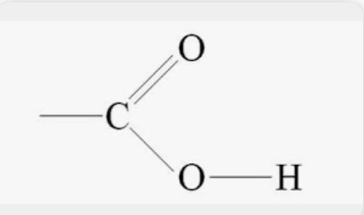

### 도파자란?
* 도파자는 영어로 dopant이다
* 교수님의 논문을 읽다가 N/S dopant라는 단어를 보고 궁금증이 생겨 조사했다
* 도파자는 반도체 소자의 전기적 특성을 제어하기 위해 도입되는 불순물 또는 원자입니다. 
* 루이스 염기성 도파자는 전자를 기부하는 능력을 지니며, 전기전도성을 증가시킨다.
* 전자 수를 증가시켜 전류의 흐름을 용이하게 만든다.
### UiO-66에 대해서
* 
* 화학 증기 침투에 의해 UiO-66 및 UiO-67의 기공 내부에 있는 Pd 나노입자의 캡슐화는 다른 입체 장애의 카르보닐 화합물의 수소화에 대해 나타난 바와 같이 형상 선택적 촉매를 생성합니다.
* 사진처럼 형상 선택적 촉매를 할 수 있다
### 열소성을 H2, Air로 하는 각각의 차이점
* H2로 하면 O가 날라가며 빈공간을 형성하고 금속부분에 Reduction이 일어나기 쉽고(전자를 얻는)
* 그에 따라서 전자를 받을 수 있는 능력인 lewis acidity가 생기고 lewis acid site의 개수인 S_LA가 커지게된다.

### 배위결합 : 비공유전자쌍을 가진 원자나 이온이 전자를 받지않아도 결합을 형성할 수 있는 능력
비공유전자쌍을 가진 원자나 이온이 전자를 받지 않으면서도 조정특성을 통해 결합이 형성될 수 있는 이유는 전자의 위치, 전하, 전자 수준 등을 조절하여 적절한 전하 균형을 유지하고 결합을 형성하기 위해 조절하는 능력 때문입니다. 이는 화학적인 환경과 상호작용에 따라 다양한 결합 형태를 가능하게 합니다.

### advanced topographies란?
advanced topographies란, MOF의 고급 토폴로지를 의미하며, 토폴로지는 MOF의 분자구조에서 이어진 원자, 또는 그룹의 연결 패턴을 의미한다
MOF는 금속이온과 유기 리간드 분자의 조합으로 형성된다. 이들의 결합패턴이 MOF의 분자구조와 토폴로지를 결정한다. MOF의 토폴로지는 고유한 결합방식과 원자 또는 분자의 배열을 나타내는데, 이는 MOF의 기능과 성질에 영향을 미친다
Advanced topographies는 MOF의 분자구조에서 더 복잡하고 정교한 토폴로지를 가리킨다.
이러한 고급 토폴로지는 MOF의 기공구조와 접합패턴을 더욱 다양하게 형성해서 새로운 성질과 응용가능성을 제공한다.

### isoreticular란
* isoreticular는 MOF에서 사용되는 용어다
* MOF계열 중에서 서로다른 금속 및 리간드 조합으로 형성된 MOF이지만, 그 구조적 토폴로지가 동일하거나 매우 유사한 경우를 가리킨다
* isoreticular MOFs는 동일한 토폴로지 패턴을 공유하는 MOFs의 집합이다
* 기능, 성질적 다양성을 가지면서도 유사한 구조를 유지한다
* 다양한 금속 및 리간드 조합으로 MOF의 구조를 조절해서 원하는 성질과 기능을 구현할 수 있는 장점을 지닌다.
* isoreticuarMOFs는 기존의 MOFs의 구조적 제한을 극복하고, 특정 MOF의 기능성을 확장하거나 조절하는데 유용하다. 
* 또한 Isoreticular MOFs의 구조적 유사성은 MOFs의 합성 및 조작과정에서도 일관성을 부여해서 연구 및 응용분야에서 더 나은 재현성과 설계가능성을 제공한다
### 결정 모형

### Hierarchically porous TiO2
* Hierarchically porous 구조란?
    * 마이크로, 메조, 매크로 까지 다양한 크기의 다공성 구조가 나타나는 구조

* 매일 만들어야함
* 방법 
    1. 1000미리-3-neck round bottom flask에 37.5ml D.I. Water 넣기
    2. 6.9g의 98퍼센트 H2So4를 넣는다
    3. 11.25g의 TiOSO4를 첨가한다
    4. 50에서 60도씨의 실리콘 오일에 stirring하며 중탕함
        (모두 녹을때 까지(투명해질때까지))
        * <video src="../0710_6일차/KakaoTalk_20230710_130053163.mp4" controls title="Title"></video>
    5. 75g의 Urea와 500g의 D.I. 물을 추가로 넣고 Urea가 다 녹으면 silicon oil을 승온해서 100~110도씨로 유지하며 stirring한다(18시간 이상)\
        * Urea를 넣을때는 유산지로 깔대기를 만들어서 넣고, 주변을 DI로 흘려보낸 후, 닦아낸 다음에 시작
        * 실리카오일에서 뺴낼때는 먼저 시트지를 아래 3겹정도 깔고, 헥산을 준비한다.
            * 헥산 저장통은 노바터치 아래 있다
        * 실리카오일을 최대한 긁어서 실리카오일통에 흘러가도록 하고, 닦아낸다
        * 그리고 실리카 오일을 헥산을 뿌려 깨끗하게 닦아낸다.
    6. 18시간 이상이 지나면, 기계를 끄고 어느정도 잡을수 있을 수준으로 온도가 내려갈때 까지 기다린다
    7. 기계에서 플라스크를 빼내고 식힌다. (약 10분정도)
        * 
        * 
    8. 필터레이션을 한다
        * 필터레이션에 필요한 물은 제법을 따라하지만, 보통 용매의 2배이상 넣는것이 일반적임
        * 방법 
            * 먼저 필터종이 크기가 다른 두개를 준비한다
            * 만두접듯이 바깥 필터를 접고
            * 필터기의 깔대기에 끼워넣는다
                * 진공을 빨아들이는 부분과 깔대기의 막힌부분이 바라보게 깔대기를 끼워넣기
            * 진공기를 키고, 압력을 확인한후, 고무 두겹을 깔대기에 덧대고
            * 깔대기에 사용하는 용매(DI면 DI)를 소량 부어서 공기틈이 없도록 진공을 적용시킨다
            * 이제 플라스크 안에있는 촉매 + 용매를 붓는다
                * 주의점은 필터 종이보다 수위가 높아지면 촉매가 누수될 수 있다
                * 주의점은 수위가 진공 흡입 부분보다 더 높아지면 역류할 수 있다
            * 압력이 올라가는 것을 확안 후, 물을 계속 부으면서 필터레이션한다

### pre-factor란?
* 반응 속도식은 일반적으로 Arrhenius 식으로 표현되는데, 다음과 같은 형태를 가진다.
    * k = A * exp(-Ea/RT)
* 여기서, k는 반응 속도 상수이며, A는 pre-factor로 알려진 선행 인자(preactivation factor)입니다. 
* 즉, pre-factor는 반응 속도식에서 지수항 앞에 곱해지는 상수이며, 반응에 참여하는 분자들의 충돌 빈도와 관련이 있습니다.
* pre-factor는 반응 속도식에서 에너지 힘항을 제외한 나머지 요소들을 나타낸다.
* 이들 요소는 반응물들의 구조, 운동 에너지, 충돌 빈도 등에 영향을 받을 수 있습니다. 따라서, pre-factor는 반응 속도를 결정하는 중요한 요소로 간주됩니다.
### 논문 01 정리
#### ABSTRACT
* 동형 및 이형 H2O2분해는 수용성 오염물질 조각들을 위한 *OH라디칼을 만드는데 초점이 있다
* 그러나, 동역학, 기계역학, 에너지적 측면에서 동형 H2O2분해는 덜 연구되었고, 분해가 어려운 오염원인 페놀을 모델로써 연구에 박차를 가했다
* -NH2/-SO3H와 함께 기능화된 UiO-66와 그것의 유사품들은 N/S도핑된 탄소 촉매들에서 ZrO2복합결정체들을 만들기 위해 열분해를 통해서 합성된다
* 촉매표면은 인접한 브뢴스테드 산 -OH와 루이스산 Zr4+사이트에 전자를 각각 다르게 기부할 수 있는, N/S도파제를 가져서 개별적인 루이스 염기 밀도를 가지며, 다양한 BA/LA 힘과 지역을 가진다.
* C_UiO-66은 흡열 H2O 왜곡에 유리한 가장 높은 E_LA 및 가장 낮은 E_BA를 나타낸 반면, C_UiO-66-SO3H는 가장 낮은 ELA 및 가장 높은 EBA를 나타냈으며, EBA만이 흡열 *OH 탈착에 유리하고 다른 기본 단계는 발열 반응으로 남겨 둡니다.
* 동역학 분석 및 DFT(밀도범함수이론) 계산은 C_UiO-66-SO3H가 가장 낮은 에너지 장벽을 가지고 있음을 보여주었고, *OH 탈착이 E_Barrier 감소를 위한 높은 E_BA의 중요성과 함께 속도 결정 스트렙임을 입증했습니다.
* 한편, S_LA가 가장 큰 C_UiO-66에서 가장 높은 pre-factor(k = Aexp(-E/RT)에서의 A)가 관찰되었으며, 이는 Zr4+와 H2O2/*OH 사이의 충돌 빈도 증가에 대한 큰 SLA의 중요성을 확증합니다.
* 이런 결과는 촉매적인 H2O2 동형분해를 통해, *OH생산성을 증진시키는데 필요한 E_BA와 S_LA를 조정하는 일을 더 잘 할 수 있게 만들어준다
#### Introduction
* 1
    * H2O2는 수용성 환경에서 수용성 오염물 분해를 위해 *OH와 *OOH또는 *O2-로 분해될 수 있다. 어떤경로로? d-block 전이금속산화물이 H2O2 분해를 수행할 수 있는 다양한 경로로
    * 특히 페놀은 높은 이온화포텐셜떄문에 전자에 의해서 라디칼화되기가 어렵고, 따라서 라디칼로의 전자의 이동보다는 라디칼 추가나 H*추출에 의해 불안정화 될 수 있다. 
    * 이런 의미로, *OH는 페놀을 분해하는데 안성맞춤이다 왜냐하면 페놀은 전자이동을 통한 오염물질들의 분해보다 추가성향이나 H *추출 성향이 강하기 떄문이다.
    * 한편 대부분의 전이금속산화물은 2가나 3가의 원자가를 갖는 루이스 산 표면금속을 지닌다.
    * 이런 금속들은 환원가능하고 주변 격자의 O원자가 방출될때 전자를 수용할 수 있는 d-오비탈을 부분적으로 소유한다.
    * 이와 비슷하게 d오비탈은 또한 H2O2의 O원자로부터 비공유전자쌍을 수용받을 수 있다. M_reduceble - H2O2 링크를 형성하기 위해서
    * d-전자의 H2O2로이동 결과는 이형 H2O2분리를 이끈다. *OH OH-를 생성하며 
    * 특히 *OH와 *OOH는 더 큰 환원 잠재력을 가진다 O2 *-보다 그리고 오염물에게서 O2- *보다 더 강하게 전자를 빼앗으려는 경항을 가진다
    * 그러므로, 오염물의 라디칼화를 증진시키고 그들의 CO2/H2O로의 분해를 O2-*보다 더 잘 이끈다
    * 그러므로 M_reducible(q+1)은 *OH재생산이나 *OOH의 생성( *OH의 대체제로써)으로 M_reducible(q)로 회복하는 과정이 필요하다
    * 추가로 H2O2는 M_reducible(q+1)에 붙어서 전자를 기부하고 M_reducible(q+1)를 환원시킨다
    * 그리곤 수용성 환경에서 방출될 수 있는 H+와 *OOH를 생산한다
    * 하지만 *OOH는 O2- *와 H+로 변환되려는 성질을 ph4.8이상의 환경에서 가지고, 이로부터 생성된 O2- *는 M_reducible(q+1)에게 전자를 기부하는 역할을 하게되고, 추가적인 *OH나 *OOH의 생산없이 M_reducible이 회복되게 된다
    * *OH(오염물 분해를 위한)를 생산하기는 하지만, *OOH의 양성자 제거반응으로 인한 손실과 M이 회복하는 H2O2소비의 추가경로로 인해 *OH의 생산성은 낮아지게 된다
* 2 
    * M_reducible종과 다르게, Zr4+ , Nb5+, Ta5+와 같은 종들(그들의 금속산화물 표면안의 해당 종) 여전히 루이스 산이지만 환원가능하지 않다.
    * 특별하게 M_Nonreducible금속들은 그들의 빈오비탈을 전자로 채우는 대신에, 표면처리를 통해 인접 O원자의 격자가 비고나서 자유전자만 제공할 수 있다.
    * 예를 들자면,tetragonal ZrO2표면에서 O원자를 팔방면으로 둘러싼 Zr+4금속은  hepta-coordinated *Zr4+로 바뀔 수 있다, 그리고 **Zr4+로도 바뀔 수 있다.(이웃O격자원자를 잃음으로써)
    * 비슷하게 H2O2가 M_Nonreducible과 6의 코디네이션 이하에서 상호작용할 때, d오비탈의 빈공간은 전자를 H2O2의 비공유전자쌍으로부터 받지 않는다. 하지만 배위결합으로 M_nonreducible**H2O2의 형성을 가능하게 한다
    * 흥미롭게도, M_nonreducible**H2O2에서 H2O2의 동형 분해는 보고되었다.
    * H2O2의 ZrO2나 Nb2O5나 Ta2O5에서의 흡착 및 탈착의 화학반응 기본 매커니즘 단계는 다름에도 불구하고, M**H2O2는 두개의 1/2M **OH종으로 바뀔수 있음은 동일하다. M에서 H2O2로의 원자간 전자 전달은 가능하지 않다.
    * 게다가 M**OH는 M **H2O2와는 다르다 왜냐하면 *OH의 O원자의 홀전자와 M의 자유 전자 사이의 공유되고 있는 전자들이 공유결합 성질을 가진 M **OH의 형성에 필수적이기 때문이다.
    * 한편 *OOH와 *O2-의 생성도 M_nonreducible에서 실현가능하다고 보고되었다. 그리고 *OOH 의 분해도 4.8ph이상에서 실현가능하다고 보고되었다.
    * *OOH가 *O2-로 바뀔수 있음에도, M_nonreducible에서 분해되는 H2O2는 *OH를 제공한다
    * 또한 중요한것은 M_nonreducible은 Mreducible에서 H2O2를 분해하는 것보다 선호되는데, 그 이유는 M_nonreducible은 재생성과정이 필요가 없기 때문이다.
* 3
    * H2O2의 분해가 M_nonreducible에서 메리트가 있다는 사실에도 불구하고, *OH를 생성하고 탈착하는 과정에 대한 고려는 다양하지만 매우 적게 보고되어왔고, 부분적으로만 해명되어왔다, *OH 생산성이 개선된 M_nonreducible금속을 발견하는데 중요한 동역학, 에너지, 반응결정단계, 표면바인딩에너지( *OH/H2O2/OH-)의 면에서.
    * 네 기초단계는 *OH 형성단계(H2O2흡착), H2O2흡착, H2O2왜곡, H2O2분해과정이다
    * 그러나 그들은 이형 H2O2분해(전이금속산화물/황화물(Mreducible종을 가진))과정에서 속도결정 흡열단계로 밝혀진 *OH의 탈착과정을 다루지 않았다. 
    * 그러므로 *OH 탈착은 동형 H2O2분해의 기초단계와 같이 고려했다(이번 연구에서)
    * 가장먼저 H2O는 ZrO2나 Nb2O5나 Ta2O5의 표면위에서 H+와 OH-를 생성하며 자발적으로 라디칼들로 분해되는 해리를 한다.
    * H+와 OH-는 표면 인접 O나, M_nonreducible종과 각각 상호작용 할 수 있다. 두개의 브뢴스테드 산 표면 사이트들을 형성하는 결과를 내면서
    * -OH의 비공유전자쌍은 M_nonreducible과 H2O2가 상호작용하는 것과 똑같이 상호작용된다.
        * 
* 5
    * 이후 BA 위치는 H2O2와 열반응을 통해 결합할 수 있으며, 이 때 H2O2의 수소 원자와 BA 위치의 산소 원자 사이에 수소 결합이 형성됩니다.
    * 그 후에 흡착된 H2O2는 흡열의 H2O2회전왜곡반응이 일어난다(H2O2의 O원자가 M과 더 가까워지게)
    * H2O2를 트위스팅하는데 필요한 에너지를 줄이려면 다음과 같은 한가지가 제안될 수 있다.
        * BA 사이트의 O원자가 H2O2의 양 끝인 H원자를 견고하게 잡아당기는것.
        * M**H2O2의 결합이 생길 수 있게 만들어 주는, H2O2의 지형적인 왜곡이 촉진될 수있게. 
    * 이것은 BA사이트가 더 강한 수소결합을 형성하기 위해, 더 적은 브뢴스테드 산강도를 가져야함을 시사한다.
    * 더 나아가서 한가지가 더 제안될 수 있다.
        * H2O2의 비공유전자쌍과의 상호작용을 증진시키고 M**H2O2의 생성을 촉진하기 위해 M_nonreducible이 강한 루이스 산 강도를 강하게 만드는것이 제안될 수 있다.
* 6
    * 흡착된 H2O2는 두개의 *OH부분(H원자가 BA사이트의 O원자와 수소결합되어있는)을 생성하는 발열 동형 O-O분해를 경험한다.
    * 이제는 BA 사이트의 o 원자는 *OH 탈착에 필요한 E_endothermic을 약화시키기 위해 *OH 흡착물의 H 원자를 쉽게 방출해야 합니다.
    * 이것은 높은 E_BA값이 BA사이트에 필요하다는 것을 암시한다
    * 게다가 *OH종은 또한 M_nonreducible종에 결합되어있다.(전자를 공유함으로써)
    * 그래서 탈착과정의 흡열량을 줄이기 위해서는 E_LA값은 반드시 커야한다.
    * 이것은 M과 그들의 자유 전자 사이에 높은 친화력을 달성하는 데 도움이 될 수 있는 반면, M 종에 가까운 자유 전자는 *OH 흡착물의 짝을 이루지 않은 전자와 공유되는 것을 꺼려하여 공유 특성을 가진 M**OH 종의 형성을 방해합니다.
    * 명백히, 균일한 H2O2 절단은 H2O2 왜곡과 *OH 탈착의 두 가지 흡열 단계를 포함하지만 표면 부위에 대한 E_BA/E_LA 값의 조절과 결합된 상세한 동역학 검사를 통해 식별되지 않은 속도 결정 단계이므로, 거의 이용되지 않아왔습니다
* 7 
    * 여기에서 우리는 일련의 ZrO2 앙상블을 합성하는 것을 목표로 했으며, 그 표면 BA 및 LA 사이트는 루이스 염기성, 전자 공여 N/S 도펀트를 근접하게 배치하여 수량 및 강도와 관련하여 조작되었습니다.
    * 이와 관련하여, Zr중심의 MOF들은 자기 희생성 다공성 템플릿으로 기능화 되었다(ZrO2와 탄소그리고 도펀트들의 전구체를 포함하는)
    * 이는 ZrO2가 불활성 분위기에서 열분해되어 탄소 스캐폴드에 고도로 분산되어 있는 ZrO2 나노 입자 및 N/S 도펀트를 생성하는 것으로 보고되었기 때문이다.
* 8
    * 예를들어 UiO66는 마이크로포러스구조로 구성된다. 12개의 벤젠 1,4 카복실레이트 Zr 산소클러스터 노
### 논문 03 정리
* UiO-66의 역사에 대한 논문
#### ABSTRACT 
* UiO-66은 전형적인 MOF이다(높은 열적 안정성과 함께 매우 넓은 표면적을 가진)
* 안정성은 금속산화물 노드가 육팔면체가 되는 것에 기여한다. 12개의 확장적인 포인트를 허용하며, (1,4-벤젠다이카복실산 코디네이션을 위한)
    * 육팔면체 사진 
    * 1,4-benzenedicarboxylic acid 사진 
    * 카복실기 이해 사진 
* 그러한 안정성과 누락된 클러스터 및 누락된 링커 결함 모두의 결함 제어로 인한 탁월한 조정 가능성 및 기능으로 UiO-66는 과학적으로 유명하다
    * UiO-66"은 Metal-Organic Frameworks (MOFs)라고 불리는 재료 중 하나로, 높은 표면적, 큰 기공체적 구조, 그리고 다양한 기능성을 가지고 있어 과학적으로 인기를 얻고 있습니다.
    * UiO-66의 특징적인 점 중 하나는 "결함 제어(defect control)"입니다. 결함 제어란 MOF 구조 내에서 결함(누락된 클러스터 또는 링커 결함)을 조절하여 구조와 성능을 조작하는 것을 의미합니다. UiO-66은 결함 제어를 통해 특정 기능을 구현할 수 있으며, 이를 통해 특정 용도에 맞는 튜너빌리티(tunability)와 기능성(functionality)을 제공합니다.
    * UiO-66의 결함 제어는 재료의 물리적, 화학적 특성에 영향을 미칩니다. 결함은 MOF의 구조적 불규칙성을 나타내는데, 이는 기체 흡착, 분자 분리, 촉매 활성화 등 다양한 응용에서 중요한 역할을 합니다. 따라서, UiO-66의 결함 제어를 통해 원하는 성능을 조절할 수 있어 다양한 과학적 연구 분야에서 인기를 얻고 있습니다.
    * UiO-66은 크기 조절이 가능한 기공 구조와 다양한 금속 및 유기 리간드 조합을 통해 다양한 화학 및 물리적 특성을 가질 수 있습니다. 이는 UiO-66의 튜너빌리티와 기능성을 높여주는 요소 중 하나입니다.
    * UiO-66의 과학적인 인기는 이러한 결함 제어와 튜너빌리티, 기능성을 통해 다양한 응용 분야에서 활용 가능한 MOF 재료로서의 잠재력을 보여주기 때문입니다. 이러한 특징은 기체 흡착, 분리, 저장, 촉매 활성화, 약물 전달, 센서 등 다양한 분야에서의 응용 가능성을 나타내며, UiO-66의 과학적 인기를 높이고 있습니다.
    * 구체적으로 UiO66의 결함을 조절할 수 있는 방법은 다음과 같다.
        * 링커 결함 조절: UiO-66의 경우, MOF를 구성하는 리간드 분자인 링커의 결함을 조절하여 구조와 성질을 조작할 수 있습니다. 링커 결함은 링커 분자의 결합 및 결합 상태에 따라 제어될 수 있습니다. 적절한 리간드 선택, 반응 조건 및 촉매를 사용하여 링커 결함을 조절할 수 있습니다.
        * 클러스터 결함 조절: UiO-66와 같은 MOFs는 금속 클러스터가 분포되어 있는데, 이 클러스터의 결함을 조절하여 구조와 성질을 변경할 수 있습니다. 이는 금속 클러스터의 합성 및 조절, 접합 조건의 조절, 금속 이온의 삽입 등을 통해 수행될 수 있습니다.
        * 동적 결함 제어: MOFs의 결함은 주로 정적인 결함이지만, 동적인 결함 제어도 가능합니다. 이는 온도, 압력 또는 기타 외부 조건의 변화에 따라 MOF 구조가 변화하면서 결함을 제어하는 것을 의미합니다. 이러한 동적 결함 제어는 화학적 또는 물리적 변화에 민감한 MOFs에서 더욱 중요해집니다.
* 이러한 특성의 콤비네이션은 많은 다른 응용에 적응될 수 있는 높은 응용성의 재료를 만든다
* 이 논문의 목적은 UiO66의 역사적인 오버뷰를 제공하기 위함이다. Zr-Based MOF의 합성전략을 바꾼, 현재뿐만 아니라 미래의까지도, 결함 제어, 수용성 결정화, 기능-안정성 절충과, 고급 지형
* isoreticular 및 reo-type을 포함한 다양한 UiO66 구조의 분석과 분말 X-선 회절, 푸리에 변환 적외선 분광법, 열중량 분석 및 질소 공극 측정법과 같은 다양한 특성화 기술도 논의됩니다.

