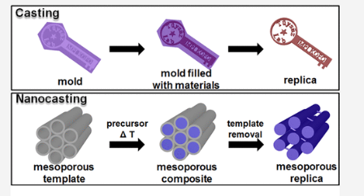

>> 분자주형법이란?
    분자설계 및 합성에 사용되는 기술.
    원하는 분자구조를 가진 화합물을 합성하기 위한 방법
    분자단위의 템플릿이나 주형을 사용.
    주로 유기화합물 합성에서 많이 사용되고, 복잡한 구조를 가지는 화합물의 합성에 유용하다.
    원하는 구조를 가진 작은 분자나 분자단위를 합성하고, 이를 기반으로 대상 화합물의 구조를 형성한다.
    템플릿 분자는 주로 미리 설계된 화합물이며, 원하는 기능이나 구조를 가진다.
    템플릿 분자를 사용해서 목표분자를 합성하는 과정에서는 템플릿 분자와 원자또는 분자단위를 연결하는 화학반응을 사용한다. 
    이를 통해 템플릿 분자의 구조가 원하는 목표분자의 구조에 전달된다.
    
    