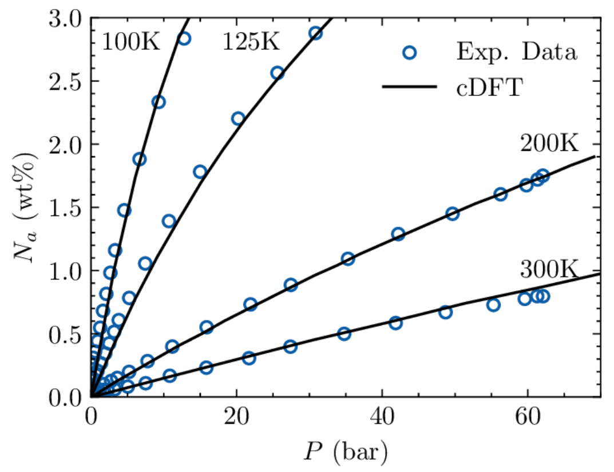

NovaTouchLX2라는 장비는
다공성촉매의 표면적과 pore size를 측정해주는 장비이다

고성능의 gas sorption 분석기이다. 

• 8분 이내의 완전 자동화된 다중 지점 B.E.T. 분석 수행
• 특허받은 NO Void Analysis™ (NOVA) 기술로 헬륨 사용 필요성 제거
• 최대 2000개의 데이터 포인트 (1000개의 흡착 포인트 및 1000개의 흡착 해제 포인트) 분석
• 샘플 분석과 동시에 진공 또는 유동 방법으로 네 개의 샘플 준비
• 흡착제 제거를 시작하거나 중지하기 위해 분석 중 디가서에 접근
• 컬러 터치스크린에서 데이터를 실시간으로 확인
• 고전 헬륨-공간 부피 모드로 세포 교정 필요성 제거
• 이더넷 연결을 통한 데이터 전송
• Windows® 호환 소프트웨어로 성능 향상
• 신속한 교정 확인으로 성능 검증
• 더 높은 분석 해상도와 속도를 위한 전용 Po 셀 및 변환기
• 바쁜 연구실의 특수한 요구를 충족

Measurement types
    B.E.T., STSA, adsorption isotherm, desorption isotherm
Surface area range
    0.01 m2 / g to no known upper limit
Pore size range
    0.35 to 500 nm (3.5 to 5000 Å)
Minimum pore volume (liquid) 
    2.2 x 10-6 ml / g
Minimum pore volume (STP)
    0.0001 cc / g

Adsorbates:                       LX2  LX4
Nitrogen                           ✓   ✓
Other non-corrosive 
gases (Ar, CO2 , H2 , C4H10, etc.) ✓   ✓

Degassing:                        LX2  LX4
Preparation ports                     4
Temperature range ambient   - 450ºC*, 1ºC intervals
Programmable heating- 
protocols              Multi-step ramp rates / hold times

흡착되지 않은 가스분자의 양을 최소화하는것 -> 분석기의 감도를 높혀줌
     최대 감도를 위해 따뜻한 상태의 부피가 많아져야 하고 차가운 상태의 부피가 적어져야 합니다.
     노바터치는 그런 장점을 가지고있음

전처리에 대한 설명

    가스 흡착 실험을 수행하기 전에는 고체 표면에서 물과 오일과 같은 오염물질을 제거해야 합니다. 표면 청소(탈기)는 대부분의 경우 고체 샘플을 유리 셀에 넣고 진공 또는 유동 가스 하에서 가열하는 방식으로 수행됩니다. 그림 1

    은 각기 다른 크기와 모양의 균열과 구멍(공극)을 포함하는 고체 입자가 전처리 후 어떻게 보일 수 있는지를 보여줍니다.

시료의 표면적을 구하는 과정

    깨끗한 상태가 된 샘플은 외부 욕조를 통해 일정한 온도로 유지되며, 그 후 작은 양의 가스(흡착체)가 단계적으로 흡착 시료 챔버로 투입됩니다. 고체 표면에 부착되는 가스 분자(흡착제)는 흡착되었다고 하며, 흡착제 분자의 단분자층으로 표면 전체를 덮는 얇은 층을 형성하려고 합니다. 잘 알려진 Brunauer, Emmett 및 Teller(B.E.T.) 이론에 따라, 흡착제 분자의 단분자층으로 흡착제 표면을 덮으려면 필요한 분자 수인 Nm을 추정할 수 있습니다(그림 2 참조). Nm을 흡착체 분자의 단면적과 곱하면 시료의 표면적을 얻을 수 있습니다.

시료의 pore 사이즈를 구하는 과정

    모노레이어 형성을 초과하는 가스 분자의 지속적인 추가는 여러 층(다중층)이 서서히 쌓이게 됩니다(그림 3 참조). 이 과정은 캐피러리 응집(capillary condensation)과 병행하여 발생합니다. 후자 과정은 가스를 응집할 수 있는 캡슐 내부의 캡슐 크기와 잔류(또는 평형) 가스 압력 사이의 비례 관계를 근사화한 켈빈 방정식으로 설명됩니다. Barrett, Joyner 및 Halenda (B.J.H.)의 고전적인 방법이나 보다 정확한 밀도 함수 이론 (Density Functional Theory, DFT) 모델과 같은 방법을 사용하여 평형 가스 압력에서의 공극 크기를 계산할 수 있습니다. 흡착된 가스 부피 대 상대 압력(평형 상태)의 실험적인 등온선은 누적 또는 미분 공극 크기 분포로 변환됩니다.

시료의 공극 부피를 계산하는 방법

    평형 흡착압력이 포화에 접근할 때, 공극은 흡착제로 완전히 채워집니다(그림 4 참조). 흡착제의 밀도를 알면 차지하는 부피와 따라서 시료의 총 공극 부피를 계산할 수 있습니다. 이 단계에서 가스의 흡착 과정을 앞뒤로 반전시키면서 시스템에서 알려진 양의 가스를 단계별로 제거하면 흡착이완선(isotherm)을 생성할 수 있습니다. 이로 인해 얻어지는 히스테리시스(이력현상. 물질이 거쳐온 과거가 현재 상태에 영향을 주는 현상, 물리량이 경과해온 과정에 의존하는 특성을 말함)(hysteresis)는 특정한 공극 모양에서 예상되는 이상적인 등온선 모양과 관련될 수 있습니다.

히스테리시스란

    물질이 특정 외부 자극에 반응할 떄 , 외부자극의 크기에 의존할 뿐만 아니라 물질의 현재상태나 과거의 외부자극 이력에 의해서도 영향을 받는 현상을 말한다.
    물질의 반응정도를 외부자극 크기 및 방향에 대한 함수로 그림을 그렸을 때 나타나는 곡선을 히스테리시스 곡선이라고 한다. 
    히스테리곡선은 대개 닫힌 고리형태를 가진다.
흡착이완선이란

    흡착체의 흡착량과 상대압력사이의 관계를 나타내는 그래프.
    일반적으로 등온에서 흡착체의 흡착과정을 연구하기 위해 흡착 이완선을 측정한다.
    흡착이완선은 흡착체의 표면적, 공극크기분포, 흡착 열 등의 특성을 평가하는 데 사용된다.
    이 그래프는 상대압력이 증가함에 따라 흡착량이 어떻게 변화하는지를 보여준다. 초기에는 흡착이 느리게 시작되고 흡착포화가 이루어질 때까지 흡착량이 급격하게 증가한다.
    이후에는 포화 상태에 도달하여 흡착량이 상대적으로 일정한 값을 유지하게 된다.

---
물리흡착 : 물리적으로 흡착되어있는 것
    피부위에 얹혀놓는다는 느낌
    보통 20KJ이하

화학흡착 : 화학적으로 흡착되어있는 것
    피부와 뼈가 강하게 결합되어있는 느낌
    보통 20KJ/mol이상
    공유결합/배위결합등으로 흡착
---
흡착 특성
 1. 흡착곡선
      등온흡착선(adsorption isotherm)
          - 일정온도에서 기체압력에 대한 흡착량을 나타냄. 
          - 흡착량, 흡착세기, 표면적, 세공크기 분포 등 고체표면의 성질을
              결정하는 자료
       등압흡착선(adsorption isobar): 
          - 온도에 따른 흡착량을 나타냄
          - 흡착 종류를 판단하기 위한 자료
---
N2 physisorbtion측정 : porous한 구조의 pore size와 pore volume과 pore표면적을 구할 수 있다.

    촉매의 porous크기는 크기기준에 따라서
    micro , meso , macro porous로 나뉜다. 
    micro porous는 2마이크로미터 이하의 pore크기를 가진다
    meso porous는 2마이크로미터에서 50마이크로미터사이의 크기를 가진다
    macro porous는 50마이크로미터 이상의 크기를 가져 눈에도 보일만큼의 구멍이 생긴다

    위와같은 porous의 기준을 보면, 옹스트롬의 단위로 측정되는 N2 자체는 다공성 pore크기에 비해서 매우작다
    그래서 N2가 다공성 pore안에 들어가며 골고루 흡착 될 수 있다

    그래서 N2를 계속 흘려보내 흡착을 시키게 되는데
    다공성물질 표면의 온도가 높을수록 표면 열에너지가 생겨서 N2의 흡착이 어려울 수 있다.
    그래서 -193도의 액체질소를 통해 다공성물질 표면의 온도를 낮춰준다

    그리고 N2를 흘려보내준다.
    압력에 따라서 N2가 흡착되는 정도를 측정하고
    이를 상대압력 - N2weight%의 그래프로 구한다
    ---상대압력과 N2Weight와의 관계식이 있기 떄문에 구할 수 있다
    이는 등온흡착선으로 불린다.
    비슷한 그래프로 등압흡착선이 있다
    이는 온도 - N2weight%의 그래프로 구한다.

    흡착제가 미세기공으로 이루어져 있을 때에는 고압부에서 가로축과 평탄역을 보인다.

    무기공 고체에서는 다음과 같은 그래프가 그려지며, 표면적을 구하기 쉽기 때문에 표준시료로 쓰인다

    중기공(meso)이 있을 때는 닫힌 루프형태의 그래프를 보일 수 있다.

---
Langmuir와 BET모델

    1. Langmuir(랑뮤어 모델)
        활성탄소섬유처럼 표면에 미세기공이 많이 존재하는 경우에 등온흡착곡선을 해석하기 위한 모델

        가정 : 
        일정 온도와 압력하에서 흡착질과 흡착제 성분사이에 동적평형상태가 존재함
        흡착을 단층으로 제한함
        흡착제의 표면은 흡착과 관련되어 에너지 면에서 모두 동일함

        ## Langmuir식

        단, P: 평형증기압, 
        V: STP(standard temp. and Pressure)에서 흡착된 기체의 부피
        Vm: Langmuir의 단분자 층의 부피
        B: 경험상수

        흡착제의 비표면적 계산 :
            Langmuir가정에서 흡착질 분자는 단층흡착을 이루므로 흡착질 분자가 가지는 총면적과 같다

            단, nm: Langmuir의 단분자 층의 몰수,
            am: 단분자층 흡착시 흡착질의 한 분자가 나타내는 평균면적, 
            L: 아보가드로 상수(6.022Ⅹ1023) 
        Langmuir흡착등온선의 적용
            랑뷰어 흡착등온선은 흡착과정을 논리적으로 보여줌
            전부는 아니지만 많은 흡착시스템에 부합됌
        Langmuir에 의한 가정의 한계
            고체표면은 불균일하고 흡착열은 일정하지 않음
            고체표면에서 기체분자의 물리흡착은 단층 이상일 수 도 있음
        
        ## BET모델
        특징 
            고체표면의 다분자 층에 적용되는 랑뷰어 모델의 확장
            표면적, 기공분포, 기공도를 측정하기 위함
            ㄷ체로 미세기공과 중기공을 가진 물질의 표면적을 측정하기 위함.
        BET식
 

    
            
    