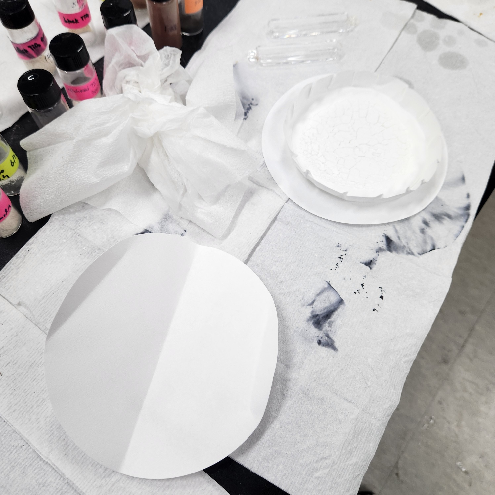
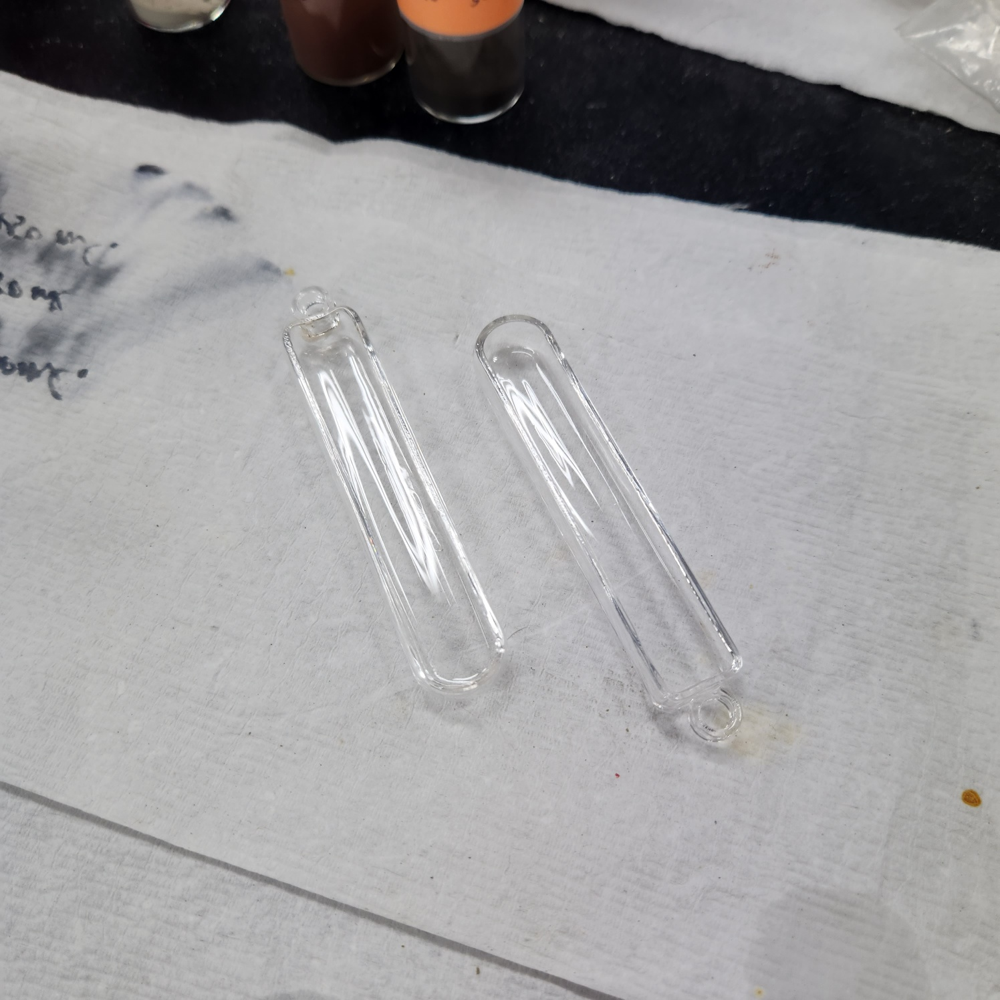
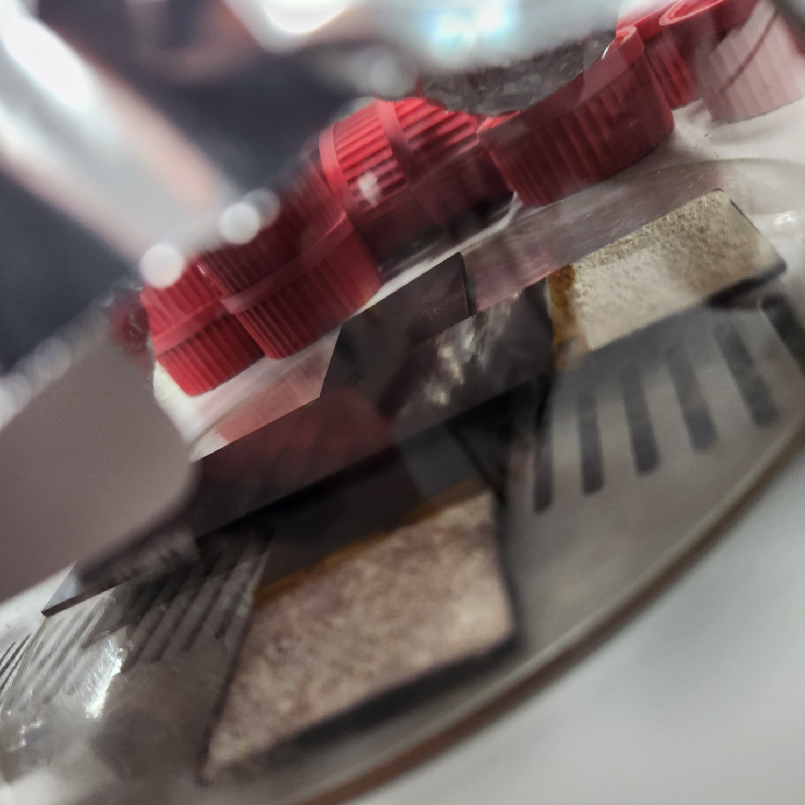
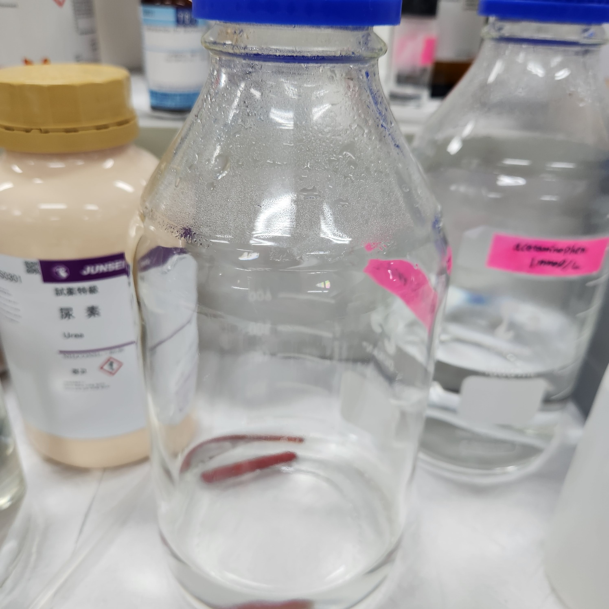

# TiO2촉매 실험 개요
1. TiO2 촉매만들기    
    1. TiO(OH)2만들기 (OK)
    2. 열처리해서 TiO2로 만들기 (OK)
    3. TiO2 + 기능기 부착 (PhosPhation) 
    4. 고운 가루형태의 TiO2를 원하는 크기(300~425um)로 소결시키기
    4. 그래파이트에 기능기붙힌 TiO2부착
2. 샘플 오염수 만들기
    1. 아닐린 용액 만들기
    2. 아닐린 용액 + 전해질 용액만들기
3. 1과 2의 결과물 반응시키기
    1. 전기 연결
    2. 교반기에 반응기 설치후 10분간격으로 시약 획득
4. 결과물 확인하기
    1. 샘플 오염수를 HPLC에 넣고 오염물 농도 측정하기
    2. 오염수 농도 측정한것으로 촉매의 오염수 정화 능력 
5. 뒤처리

---

### Hierarchically porous TiO2
* Hierarchically porous 구조란?
    * 마이크로, 메조, 매크로 까지 다양한 크기의 다공성 구조가 나타나는 구조

* 매일 만들어야함
* 방법 
    1. 1000미리-3-neck round bottom flask에 37.5ml D.I. Water 넣기
    2. 6.9g의 98퍼센트 H2So4를 넣는다
    3. 11.25g의 TiOSO4를 첨가한다
    4. 50에서 60도씨의 실리콘 오일에 stirring하며 중탕함
        (모두 녹을때 까지(투명해질때까지))
        * <video src="../날마다정리/0710_6일차/KakaoTalk_20230710_130053163.mp4" controls title="Title"></video>
    5. 75g의 Urea와 500g의 D.I. 물을 추가로 넣고 Urea가 다 녹으면 silicon oil을 승온해서 100~110도씨로 유지하며 stirring한다(18시간 이상)\
        * Urea를 넣을때는 유산지로 깔대기를 만들어서 넣고, 주변을 DI로 흘려보낸 후, 닦아낸 다음에 시작
        * 실리카오일에서 뺴낼때는 먼저 시트지를 아래 3겹정도 깔고, 헥산을 준비한다.
            * 헥산 저장통은 노바터치 아래 있다
        * 실리카오일을 최대한 긁어서 실리카오일통에 흘러가도록 하고, 닦아낸다
        * 그리고 실리카 오일을 헥산을 뿌려 깨끗하게 닦아낸다.
    6. 18시간 이상이 지나면, 기계를 끄고 어느정도 잡을수 있을 수준으로 온도가 내려갈때 까지 기다린다
    7. 기계에서 플라스크를 빼내고 식힌다. (약 10분정도)
    8. 필터레이션을 한다
        * 필터레이션에 필요한 물은 제법을 따라하지만, 보통 용매의 2배이상 넣는것이 일반적임
        * 방법 
            * 먼저 필터종이 크기가 다른 두개를 준비한다
            * 만두접듯이 바깥 필터를 접고
            * 필터기의 깔대기에 끼워넣는다
                * 진공을 빨아들이는 부분과 깔대기의 막힌부분이 바라보게 깔대기를 끼워넣기
            * 진공기를 키고, 압력을 확인한후, 고무 두겹을 깔대기에 덧대고
            * 깔대기에 사용하는 용매(DI면 DI)를 소량 부어서 공기틈이 없도록 진공을 적용시킨다
            * 이제 플라스크 안에있는 촉매 + 용매를 붓는다
                * 주의점은 필터 종이보다 수위가 높아지면 촉매가 누수될 수 있다
                * 주의점은 수위가 진공 흡입 부분보다 더 높아지면 역류할 수 있다
            * 압력이 올라가는 것을 확안 후, 물을 계속 부으면서 필터레이션한다
    9. 우리 실험실에서는 클로로포름이나, 초임계처리를 하지 않는듯하다. 따라서 여기까지만 하고, 상온에 바싹 말린후에 다음단계인 소성시키기를 진행하면 된다
            
>## TiO(OH)2 만들어진거 저장하기
* 방법
    1. 준비물 준비 
        * 빈 유리병(작은거)
        * 쇠긁개 
        * 쇠스푼
        * 원형 유선지 종이
    2. 단계 1
        원형 유선지 종이에 쇠긁개로 TiO(OH)2가루를 옮긴다
        
    3. 단계 2
        덜 옮겨진 가루들을 쇠 스푼으로 살살긁어 옮긴다
    4. 단계 3
        빈 유리병에 옮겨 담는다.
>## TiO2만들기(ver.1)(공기와의 열처리)
* 만들어진 TiO(OH)2를 열처리해서 TiO2로 만들기
* 우리 연구실의 열소성기를 이용
* 방법
    0. 준비물 준비
    * 유리투브
        
    1. (유리)튜브에 TiOOH가루 1.2그램을 담는다
    
    
    2. 열소성기 안에 튜브를 넣는다
        넣을 때는 긴 쇠막대를 이용해서 중간부분까지 밀어넣기
    3. 고밀도 공기(99.999%의 N2, O2) 탱크의 관을 소성기의 관에 연결하고 꽉 조인다.
    4. 소성기를 키고, 설정할 조건에 맞게 기계를 설정
<video src= "../날마다정리/0710_6일차/KakaoTalk_20230706_142806743.mp4" controls title="Title"></video>
<video src="../날마다정리/0710_6일차/KakaoTalk_20230706_142817320.mp4" controls title="Title"></video>
<video src="../날마다정리/0710_6일차/KakaoTalk_20230706_142441559.mp4" controls title="Title"></video>
    5. 소성기 작업이 끝나면 결과물인 TiO2가 담긴 튜브를 쇠막대로 꺼내기
    6. 튜브속의 TiO2들을 빈통에 담는다
    7. 빈 통에 TiO2의 상세 실험조건들이 담긴 종이를 붙힌다
    8. 튜브 Di로 닦고 오븐에 말리고 마무리
''' '''

## TiO2만들기 열처리가 끝나 TiO2분말이 된것을 원하는 직경 범위내의 입자로 만들기
* 오늘은 300마이크로미터에서 425마이크로미터 필터를 써서, 300 ~ 425마이크로미터 범위의 입자를 채털기함
* 준비물 : 채 ,압축기, TiO2분말, 입자 담을 빈통, 막자사발, 절구통, 프레스몰드
* 방법 : 
    1. 원하는 직경 범위의 채들, 프레스 몰드, TiO2분말, 입자담을 빈통, 막자사발, 절구통을 준비해서 알코올로 한번 소독한다
    2. 프레스 몰드에 적정량의 분말을 담고 고루 펴준뒤에 프레스몰드를 닫고, 압축기에 넣어준다.
    3. 압축기에서 압력 3.5에 설정해두고 40초간 기다린다.
    4. 압축이 완료된 프레스 몰드를 가지고 실험테이블로 가서 딱딱하게 뭉친 TiO2를 털어내고 적절히 갈아 채에 골라지게한다.
    5. 반복
* 뒷정리 및 마무리 방법
    1. 골라지지 않은 미세 TiO2들은 다시 다른 통에 담아둔다

>## TiO2만들기(ver.2)(수소환경에서의 열처리)
* 수소환경에서 TiO(OH)2를 TiO2로 바꾸기
* 아직 배우지 않음

>## TiO2전극 만들기
* 만든 TiO2를 그래파이트에 접착제와 에탄올을 이용해서 붙히고 말려 굳히기
* 방법
    1. 준비물 준비
        * PhosPhation 0.2g(TiO2에 기능기를 추가한것 . 인을 추가한것?)
        * 에탄올 0.7g
        * 바인더 0.2g
    2. 트레이(소)에 Phosphation -> 에탄올 -> 바인더 순서대로 정량 후 빠르게 섞어주기(마르기 전에)
        * 바인더가 제대로 섞이지 않고 뭉쳐있으면 추후에 그래파이트에서 촉매가 분리될 수 있음
    3. 깨끗한 그래파이트에 3cmx4cm의 면적으로 평평하게 바르기
        * 평평하게 고루 바를수록 좋음
    4. 오븐에 110도씨 (은박지를 싸서) 6시간 보관후 꺼내주고 식혀준다.
    5. 꺼낸뒤에 원형 유리통에 촉매부분이 겹치지않게 교차로 넣어주고, 은박지로 덮어준다 

>## 아닐린 용액 만들기
* (만든 TiO2전극을 가지고 정화시켜보는 실험을 할)오염수 만들기
* 방법 : 1mmol/L의 아닐린 용액 1L를 만들기(오염수 병을 사용)
    0. 아닐린, 오염수 통, D.I.준비
    
    1. 먼저 D.I.를 오염물질 병에 필요한 양만큼 넣고(1L)
    2. 아닐린 1mmol만큼의 g수를 분자량 계산해서 넣어준다. 
    (1mmol 아닐린 -> 0.093g)
    3. 그 용액을 교반기에 놓고 섞어준다
* 유리스포이트를 쓰는 이유
   * 일반 스포이드로 하면 소량 정량을 수행하기 어렵기 떄문에 유리스포이드를 쓴다
* 아닐린은 짙은 갈색의 액체 C6H5NH2

>## 전극촉매를 넣고 stirring할 용액을 만들기 
* 오염수에 Na2So4를 넣어준(왜? >> )
* 방법
    1. 준비물 준비 : 아닐린 용액 100미리 + Na2So4 녹은용액 0.7g (전해질)
    2. 오염수와 촉매의 반응을 지켜볼 비커수만큼 비커를 준비해서 각각 1번의 준비물을 혼합해줌(이번의 경우 2개를 만듦)
    3. 교반기에 넣고 섞어준다 

>## TiO2가 발린 전극(그래파이트)를 이용해서 오염수와 반응시키기
* 오염수를 TiO2로 정화하기
* 시간별로 오염수 정화정도를 체크하기 위해, 일정시간 간격으로 오염수 시약을 확보하는 작업이 필요
* 이 실험에서는 H2O2를 따로 넣지않음
    * 그 이유는 H2O2가 전극에 의해서 자동으로 생성되기 떄문에(★★★★★)
* 방법 : TiO2가 발린 Cathod와 발리지 않은 Anode를 이용해서 stirring하며 반응시키기
    0. 준비물 준비 : 작은주사기 , 주사기 필터 , 작은 vial여러개 준비, 장갑, 스티로폼, 촉매발린 전극, 마그네틱바, 오염수, 교반기, 전압기, 전해질 들어간 오염수
    ![Alt text]../날마다정리/0710_6일차/(../날마다정리/0710_6일차/KakaoTalk_20230706_142423476.jpg)
    
    1. 캐소드와 애노드를 스티로폼에 꽂고
    2. 용액 표면에 딱 맞게 담근다
    3. 전압을 걸어줌과 동시에 stirring진행
    
    
    4. 바로 0min의 결과를 추출
    5. min 10min 20min 30min 40min 50min 60min마다 필터를 이용해서 오염수만 추출(촉매는 뺴고)
    
    6. 매 오염수 추출시행마다 오염수를 vial에 담은 직후에 메탄올을 피펫으로 넣어주기 : 빨간 피펫 0.1
    
    6. 결과물 : 시간별로 정화된 결과가 담긴 vial병

>## 뒤처리 : TiO2전극으로 오염수 정화시키는 반응이 끝나고 
* 뒷청소 하기
* 방법
    1. 전압기를 끄기
    2. 교반기를 끄기
    3. 집게 뽑기
    4. 전극 빼기
    5. (마그네틱 안빠지게 조심해서)유기폐기물 버리기
    6. 스티로폼 다시 갖다놓기
    7. 그래파이트 전극을 아세톤에 담그고 서로 긁으면서 닦아내기
    
    8. 잘 안 닦이는거는 쇠긁개로 긁고 실험티슈로 닦아내기
    9. 그래파이트 제자리에 두기
    10. 비커 표면에 금속물질이 안사라지면 왕수로 세척 / 그렇지 않고 꺠끗하면 그냥 설거지 

>## HPLC찍기
* 아직 배우지 않음